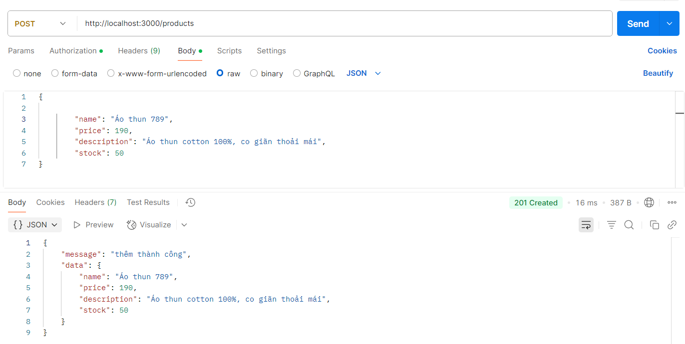
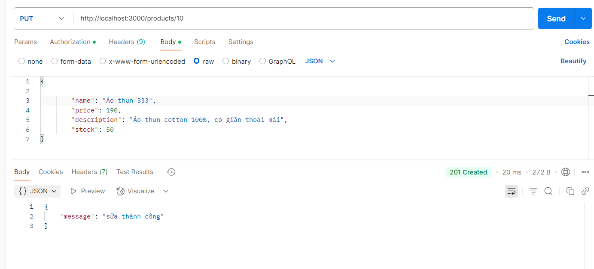
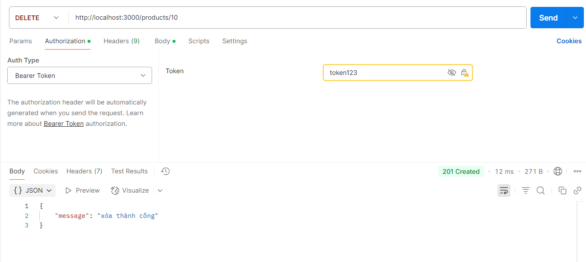

####  1. Cách chạy project 
* cd vào database/day03
* npm install 
* npm run dev

#### 2. SQL cho database
```sql
CREATE TABLE products (
    id INT AUTO_INCREMENT PRIMARY KEY,
    name VARCHAR(255),
    price FLOAT,
    description TEXT,
    stock INT
);
INSERT INTO products (name, price, description, stock) VALUES
('Áo thun nam', 199000, 'Áo thun cotton 100%, co giãn thoải mái', 50),
('Điện thoại Samsung Galaxy A14', 3990000, 'Smartphone 6.6 inch, pin 5000mAh, camera 50MP', 20),
('Laptop Dell Inspiron 15', 15990000, 'Laptop học tập, làm việc, RAM 8GB, SSD 256GB', 10),
('Giày thể thao Nike', 1290000, 'Giày thể thao chính hãng, nhẹ, thoáng khí', 35),
('Máy xay sinh tố Philips', 899000, 'Công suất 350W, lưỡi dao inox, dễ vệ sinh', 25),
('Tai nghe Bluetooth Sony', 990000, 'Chống ồn, pin 30 giờ, kết nối Bluetooth 5.0', 0),
('Bàn phím cơ AKKO', 1090000, 'Bàn phím cơ LED RGB, switch Gateron', 15),
('Ghế gaming Extreme Zero', 2990000, 'Ghế ngồi chơi game, đệm dày, tựa lưng cao', 5),
('Túi đeo chéo Adidas', 490000, 'Túi thời trang, chất liệu bền, nhỏ gọn', 40),
('Bình giữ nhiệt Lock&Lock', 350000, 'Dung tích 500ml, giữ nhiệt lên đến 8 giờ', 60);

```
* database : product
* table : products

### 3. Cấu hình kết nối mysql database sử dụng các biến env và connector mysql2 
```javascript
// db/config.js
import {createConnection} from 'mysql2';
import { config } from 'dotenv';
config();

try {
    // console.log('log ' + process.env.DATABASE,process.env.HOST);
    var connection = createConnection({
        database : process.env.DATABASE,
        host : process.env.HOST,
        user : process.env.USER,
        password : process.env.PASSWORD,
        port : process.env.PORT,
    
    })
} catch (error) {
   console.log(error);
}
export default connection.promise();
```
#### 4. Viết API & Test API
##### 4.1 API GET /products: Lấy toàn bộ sản phẩm từ bảng products và trả về kết quả dạng JSON.
```javascript
// controller/productController.js
import createHttpError from "http-errors";
import { getAllProduct as _getAllProduct, addProduct as _addProduct ,updateProduct as _updateProduct, deleteProduct as _deleteProduct } from "../models/product.js";

export async function getAllProduct(req, res, next) {
    try {
        let allProduct = await _getAllProduct();
        res.json(allProduct);
    } catch (error) {
        next(error);
    }
}
```
##### kết quả : Test bằng Postman


##### 4.2 API POST /products: Thêm mới một sản phẩm vào bảng products.
```javascript
// controller/productController.js
export async function addProduct(req, res, next) {
    try {
        if (!req.body) return next(createHttpError(500, 'Thiếu thông tin'));

        let { name, description, price, stock } = req.body;
        if(!name || !description || !price || !stock) return res.send('thiếu data');
        // console.log(JSON.stringify(req.body));
        let condition = await _addProduct(name, price, description, stock);
        if (condition) return res.status(201).json({
            message: 'thêm thành công',
            data: req.body
        })
    } catch (error) {
        next(error);
    }
}
```
##### kết quả : Test bằng Postman

##### 4.3 API PUT /products/:id: Cập nhật thông tin của sản phẩm dựa trên id.
```javascript
// controller/productController.js
export async function updateProduct(req, res, next) {
    try {
        const id = req.params.id;
        let { name, description, price, stock } = req.body;
        if(!name || !description || !price || !stock) return res.status(500).send('thiếu data');
         console.log(JSON.stringify(req.body));
        let condition = await _updateProduct(id,name,description,price,stock);
        if(condition) return .status(201).json({
            message: "sửa thành công"
        })
    } catch (error) {
        next(error);
    }
}
```
##### kết quả : Test bằng Postman

##### 4.4 API DELETE /products/:id: Xóa sản phẩm dựa trên id.
```javascript
// controller/productController.js
export async function deleteProduct(req, res, next) {
    try {
        let id = req.params.id;
        if(!id) return res.status(500).json({
            message:'thiếu id product'
        })
        let condition = await _deleteProduct(id);
        if(condition) return res.status(201).json({
            message: "xóa thành công"
        })
    } catch (error) {
        next(error);
    }
}
```
##### kết quả : Test bằng Postman
