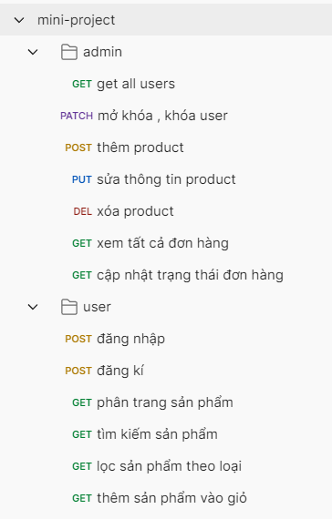

## Day 04 - Middleware, Error Handling, Logger trong Express.js (  Mini Project – Order Management System ) 

### Mục tiêu:

* Hiểu rõ Middleware là gì, cách hoạt động và ứng dụng thực tế
* Biểu cách xử lý lỗi đúng chuẩn RESTful API
* Làm quen với logger: console.log và thư viện Morgan
* Xây dựng một hệ thống backend để quản lý đơn hàng, sản phẩm và người dùng. Người dùng có thể đăng ký, đăng nhập, đặt hàng. Admin có thể theo dõi và cập nhật trạng thái đơn hàng.

### Các yêu cầu về kỹ thuật
* Node.js + Express.js
* MySQL (qua mysql2)
* JWT cho authentication
* Logger: Morgan
* Postman để test API
### Các tính năng chi tiết
#### 1. Authentication
* Đăng ký: POST /auth/register (name, email, password)
* Đăng nhập: POST /auth/login (email, password)
* Bảo vệ route bằng JWT
* Mã hóa password bằng bcrypt
#### 2. Quản lý người dùng (admin)
* Danh sách người dùng: GET /admin/users
* Khóa/mở tài khoản: PATCH /admin/users/:id/lock
#### 3. Quản lý sản phẩm
Table: products (id, name, price, stock, description, category)
Các API cần làm :
* GET /products
* POST /admin/products
* PUT /admin/products/:id
* DELETE /admin/products/:id
* Có phân trang, tìm kiếm theo tên, lọc theo category
* Validate dữ liệu
#### 4. Đặt hàng (Order)
* Tables:
    * orders (id, user_id, total_price, status, created_at)
    * order_items (id, order_id, product_id, quantity, price)
* Các API cần làm:
    * POST /orders: tạo đơn hàng (nhiều sản phẩm)
    * GET /orders: xem đơn hàng của user
    * GET /admin/orders: admin xem tất cả đơn
    * PATCH /admin/orders/:id/status: cập nhật trạng thái đơn
    * Tự động trừ stock khi đặt hàng thành công
#### 5. Middleware & Error Handling
* Middleware xác thực token
* Middleware phân quyền
* Middleware validate input
* Error handler global
#### 6. Logger
* Sử dụng Morgan log mọi request
* Ghi log lỗi ra console

### Cấu trúc cây thư mục trong project
```
root/
│
├── node_modules/           # Thư viện cài đặt thông qua npm
│
├── src/                    # Thư mục chứa toàn bộ mã nguồn chính
│   ├── config/             # Cấu hình chung (ví dụ như database)
│   │   └── db.js           # Cấu hình kết nối CSDL
│   │
│   ├── controllers/        # Các controller xử lý logic cho các route
│   │   ├── admin.controller.js
│   │   ├── auth.controller.js
│   │   ├── order.controller.js
│   │   └── product.controller.js
│   │
│   ├── middleware/         # Các middleware xử lý trung gian
│   │   ├── auth.middleware.js
│   │   ├── error.middleware.js
│   │   ├── logMorgan.js
│   │   └── validate.middleware.js
│   │
│   ├── routes/             # Các định tuyến API
│   │   ├── admin.routes.js
│   │   ├── auth.routes.js
│   │   ├── order.routes.js
│   │   ├── product.routes.js
│   │   └── user.routes.js
│   │
│   └── untils/             # Các hàm tiện ích, dùng chung
│       ├── hashPassword.js
│       └── jwt.js
│
├── .env                    # Tập tin biến môi trường thực tế
├── .env.example            # Ví dụ mẫu cho biến môi trường
├── access.log              # File log truy cập (có thể do morgan ghi)
├── app.js                  # File khởi động ứng dụng chính
├── package.json            # Quản lý dependency và script
└── package-lock.json       # Khóa version các dependency
```
### Các Framework and thư viện:
* express: Framework để xây dựng ứng dụng web và API.
* mysql2: Thư viện để kết nối và làm việc với cơ sở dữ liệu MySQL.
* bcryptjs: Thư viện để mã hóa mật khẩu.
* jsonwebtoken: Thư viện để tạo , giải mã token để xác thực người dùng
* morgan: Middleware để ghi log các request HTTP.
* dotenv: Thư viện để quản lý các biến môi trường từ file .env.

### Cách chạy dự án 
```
- Chuẩn bị các biến mỗi trường cho vào file .env (mẫu các biến trong file .env.example)
- npm install
- npm run dev
```
### File run (app.js)
```javascript
import express from 'express';
import createError from 'http-errors';
import adminRoute from './src/routes/admin.route.js'
import authRoute from './src/routes/auth.routes.js'
import productRoute from './src/routes/product.routes.js'
import orderRoute from './src/routes/order.routes.js'
import { errorHandle } from './src/middleware/error.middleware.js';
import { devMorgan } from './src/middleware/logMorgan.js';
const app = express();
const port = 3000;


// app.use(morgan)
app.use(express.json());
app.use(devMorgan);
app.use('/admin',adminRoute);
app.use('/auth',authRoute);
app.use('/products',productRoute)
app.use('/orders',orderRoute)
app.use((req, res, next) => {
    return next(createError(404, 'Not Found'));
})

app.use(errorHandle)
app.listen(port, () => {
    console.log(`server is running at http://localhost:${port}`);
})

```
#### Tổng quan về các API route
##### 1. Route admin 
```javascript
//admin.route.js
import { Router } from "express";
import { addProduct, deleteProduct, getAllOrders, getAllUser, lockAcc, updateOrderStatus, updateProduct } from "../controllers/admin.controller.js";
import { authAdminMiddleware } from "../middleware/auth.middleware.js";
import { validateProduct } from "../middleware/validate.middleware.js";
let route = Router();
route.get('/users',authAdminMiddleware,getAllUser); // admin lấy toàn bộ thông tin users
route.patch('/users/:id/lock',authAdminMiddleware ,lockAcc); // admin khóa tài khoản users

route.post('/products',authAdminMiddleware,validateProduct,addProduct); // admin thêm product
route.put('/products/:id',authAdminMiddleware,updateProduct); // admin sửa thông tin của 1 product
route.delete('/products/:id',authAdminMiddleware,deleteProduct); // admin xóa 1 product

route.get('/orders',authAdminMiddleware,getAllOrders);// admin xem tất cả đơn
route.patch('/orders/:id/status',authAdminMiddleware,updateOrderStatus);  //cập nhật trạng thái đơn
export default route;

// GET /products
// POST /admin/products
// PUT /admin/products/:id
// DELETE /admin/products/:id

```
##### 2. Route auth (đăng nhập , đăng ký người dùng)
```javascript
//auth.routes.js
import { Router } from "express";
import { authRegister,authLogin } from "../controllers/auth.controller.js";
let route = Router();
route.post('/register',authRegister); // user đăng nhập 
route.post('/login',authLogin); // user đăng ký

export default route;
```
##### 3. Route product (người dùng có thể không cần đăng nhập)
```javascript
//product.routes.js
import { Router } from "express";
import { getAllProduct,filterProduct,searchByName } from "../controllers/product.controller.js";

let route = Router();

route.get('/:page',getAllProduct); // phân trang sản phẩm
route.get('/filter/:category',filterProduct); // lọc sản phẩm theo loại
route.get('/search/:name',searchByName); // tìm kiếm sản phẩm
export default route;

```
##### 4. Route order (người dùng phải đăng nhập)
```javascript
//order.routes.js
import { Router } from "express";
import { addOrderItem, getOrder } from "../controllers/order.controller.js";
import { authUserMiddelware } from "../middleware/auth.middleware.js";

let route = Router();
route.post('/',authUserMiddelware, addOrderItem); //  user thêm sản phẩm vào giỏ hàng 
route.get('/',authUserMiddelware,getOrder); // user xem đơn hàng

export default route;

```
#### Tổng quan về các middleware
##### 1. Middleware dùng để xác thực route thực admin và user 
```javascript 
//auth.middleware.js
import jwt from "jsonwebtoken";
import { config } from 'dotenv'
config()
export async function authAdminMiddleware(req, res, next) {
    try {
        if (!req.header('Authorization')) return res.status(403).json({ message: "Chưa đăng nhập" });
        let token = req.header('Authorization').split(' ')[1];
        jwt.verify(token, process.env.SECRET, { algorithms: "HS256" }, (err, payload) => {
            if (err) return res.status(403).json({ message: "Token hết hạn hoặc không hợp lệ" });
            if (payload.role === 'user') return res.status(403).json({ message: "Bạn không có quyền admin" });
            req.user = payload;
            console.log(payload);
            next();
        });
    } catch (error) {
        console.log(error);
        next(error);
    }
}

export async function authUserMiddelware(req, res, next) {
    try {
        if (!req.header('Authorization')) return res.status(403).json({ message: "Chưa đăng nhập" });
        let token = req.header('Authorization').split(' ')[1];
        jwt.verify(token, process.env.SECRET, { algorithms: "HS256" }, (err, payload) => {
            if (err) return res.status(403).json({ message: "Token hết hạn hoặc không hợp lệ" });
            if (payload.role === 'admin') return res.status(403).json({ message: "Bạn không có quyền user" });
            req.user = payload;
            console.log(payload);
            next();
        });
    } catch (error) {
        console.log(error);
        next(error);
    }
}

```
##### 2. Middleware dùng để xử lý lỗi 
```javascript
``error.middleware.js
export function errorHandle(err,req,res,next){
    res.json({
        status : err.status || 500,
        message : err.message
    })
}
```
##### 3. Middleware dùng để log terminal các request đến server
```javascript
import morgan from "morgan"
import { createWriteStream } from "fs";
let accessLogStream = createWriteStream('access.log', { flags: 'a' });
let combinedMorgan = morgan('combined', {
    stream: accessLogStream,
    // skip: (req, res) => {
    //     return res.statusCode > 400 // bỏ qua log file khi respone status code > 400 
    // }
})

let devMorgan = morgan('dev');
let tinyMorgan = morgan('tiny')
export {combinedMorgan,devMorgan,tinyMorgan}


```
##### 4. Middleware dùng để validate dữ liệu gửi lên server
```javascript


export  function validateProduct(req, res, next) {
    const { name, price, stock, description, category } = req.body;
  
    if (!name || !price || !stock || !description || !category) {
      return res.status(400).json({ error: "Missing required fields." });
    }
  
    if (typeof name !== "string" || typeof description !== "string" || typeof category !== "string") {
      return res.status(400).json({ error: "Name, description, and category must be strings." });
    }
  
    if (typeof price !== "number" || price <= 0) {
      return res.status(400).json({ error: "Price must be a positive number." });
    }
  
    if (!Number.isInteger(stock) || stock < 0) {
      return res.status(400).json({ error: "Stock must be a non-negative integer." });
    }
    next(); 
  }
  
  
```
###  Tổng quan Postman collection test API

File [mini-project.postman_collection.json](./mini-project.postman_collection.json)


