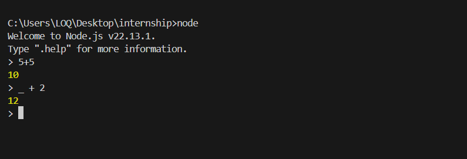
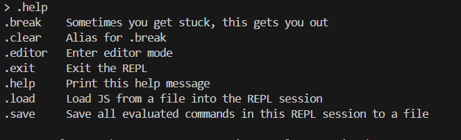
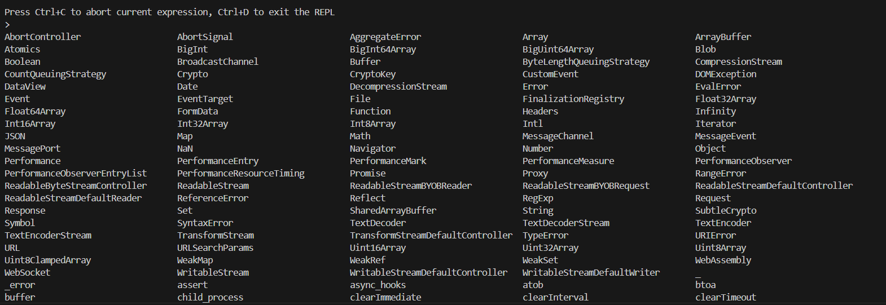
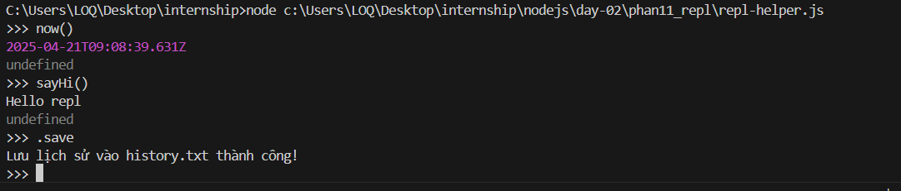
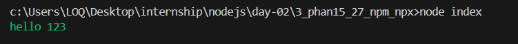
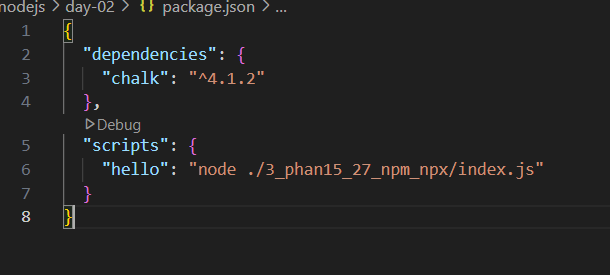
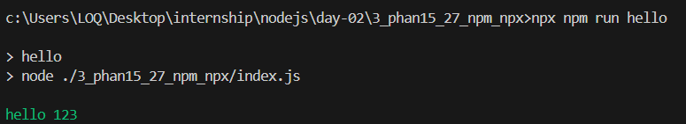
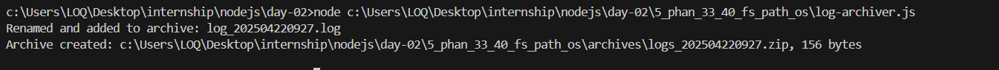

# PHẦN 11: REPL
### Câu hỏi:
### 1. REPL là gì?
* REPL là viết tắt của Read Evaluate Print Loop, và là môi trường ngôn ngữ lập trình (về cơ bản là cửa sổ console) lấy một biểu thức làm đầu vào của người dùng và trả kết quả trở lại console sau khi thực thi. Phiên REPL cung cấp một cách thuận tiện để nhanh chóng kiểm tra mã JavaScript đơn giản.
* Read: Nhập một đoạn mã
* Eval: Đánh giá/Thực thi đoạn mã đó
* Print: In kết quả ra màn hình
* Loop: Quay lại để chờ lệnh tiếp theo

- Biến _ trong REPL để làm gì?
* Biến _ chứa giá trị trả về gần nhất từ lệnh bạn vừa thực hiện.


- Các lệnh đặc biệt như .help, .exit dùng khi nào?
* .help :	Hiển thị danh sách các lệnh REPL có sẵn
* .exit :	Thoát khỏi REPL
ví dụ lệnh help:

ví dụ lệnh tab:


Bài tập nâng cao:
- Tạo một file repl-helper.js khởi chạy custom REPL:
```javascript

const repl = require('repl');
const fs =  require('fs');
const path = require('path');

const r = repl.start({
    prompt: '>>> ',
    completer: customCompleter
  });
// Gợi ý các lệnh
function customCompleter(line) {
  const commands = ['sayHi', 'now', 'sum', '.save'];
  const hits = commands.filter(c => c.startsWith(line));
  return [hits.length ? hits : commands, line];
}

// Định nghĩa lệnh
r.context.sayHi = () => console.log('Hello repl');
r.context.now = () => console.log(new Date());
r.context.sum = (a, b) => console.log(a + b);


r.defineCommand('save', {
  help: 'Lưu lịch sử vào history.txt',
  action() {
    const history = r.history.slice().reverse().join('\n');
    fs.writeFileSync(path.join(__dirname,'/history.txt'), history, 'utf8');
    console.log('Lưu lịch sử vào history.txt thành công!');
    this.displayPrompt();
  }
});

```
- Gợi ý (autocomplete) các lệnh tự tạo: sayHi, now, sum(a,b)
- Khi gõ .save thì lưu lịch sử REPL vào file history.txt


# PHẦN 12–14: Command line
### Câu hỏi:
### 1. Làm sao nhận input từ process.argv?
* process.argv là một mảng chứa các đối số dòng lệnh truyền vào khi chạy chương trình Node.js.
ví dụ : node sum.js 3 4
process.argv sẽ là: [
  '/path/to/node',
  '/path/to/sum.js',
  '5',
  '10'
]

### 2. Khác biệt giữa stdout và stderr?
* stdout: luồng dữ liệu tiêu chuẩn (kết quả thành công).
* stderr: luồng lỗi tiêu chuẩn (thường là thông báo lỗi hoặc cảnh báo).
* process.stdout : Dùng để ghi dữ liệu ra đầu ra tiêu chuẩn (màn hình console)
* process.stderr : Dùng để ghi dữ liệu ra dòng lỗi tiêu chuẩn 

### 3. Cách dùng readline?
* readline là một module có sẵn (built-in) dùng để tạo giao diện dòng lệnh, cho phép bạn đọc dữ liệu từng dòng từ input (ví dụ: từ bàn phím hoặc file) một cách dễ dàng.
* readline dùng khi : 
  * Đọc dữ liệu từ người dùng (qua stdin)
  * Đọc từng dòng từ file
  * Tạo giao diện dòng lệnh đơn giản (kiểu như hỏi đáp)
readline.createInterface: tạo một interface để giao tiếp với input/output (example : phan12_14_CommandLine/readline.js)
rl.question(): in câu hỏi và chờ người dùng nhập
rl.close(): đóng interface sau khi xong

# PHẦN 15–27: npm & npx
### Câu hỏi:
### 1. dependencies vs devDependencies?
dependencies: là các thư viện cần thiết khi chạy ứng dụng (production).
VD: express, chalk (nếu app in màu trong sản phẩm thật).
devDependencies: là các thư viện chỉ dùng khi đang phát triển sản phẩm (development).
VD: nodemon, eslint, prettier, mocha.

### 2. Khi nào dùng npx?
Dùng npx để
* Khi muốn dùng thử một gói mà không cần cài đặt hoặc khi bạn muốn thực thi một gói đã được cài đặt cục bộ
* Chạy package mà không cần cài vào global.
* Chạy script trong package.json.
* Chạy file CLI (bin) từ local/global package.
VD: npx create-react-app, npx eslint ., npx slugify-cli "xin chào bạn"

### 3. Tác dụng của package-lock.json?
* package-lock.json sẽ tự động được tạo khi bạn sử dụng npm từ bản ^5.x.x
* Nên giữ lại file package-lock.json để đảm bảo tính tương thích giữa các dependencies
* Nên COMMIT package-lock.json vào hệ thống quản lý code mà bạn sử dụng (Git, SVN,...)
* Không được xóa package-lock.json chỉ để chạy npm install và generate lại nó
* Từ phiên bản ^5.1.x, package.json có quyền hạn cao hơn package-lock.json (source of truth)
* Ghi lại chính xác phiên bản từng thư viện (và cả thư viện phụ).
* Giúp đảm bảo các máy cài đúng cùng phiên bản.

### Bài tập nhỏ:
### Tạo package.json, cài chalk, in dòng màu.


### Tạo script hello gọi bằng npx.



### Viết 1 CLI tool tên slugify-cli:
Chuyển chuỗi tiếng Việt thành slug URL (VD: "Xin chào bạn" → xin-chao-ban)
```javascript
//bin/index.js
#!/usr/bin/env node
const toSlug = require('../lib/slugify');

const input = process.argv.slice(2).join(' ');

if (!input) {
  console.log('⚠️ Vui lòng nhập chuỗi cần slug!');
  process.exit(1);
}

console.log(toSlug(input));

```
Viết module riêng trong lib/slugify.js
```javascript
//lib/slugify.js
const slugify = require('slugify');

function toSlug(input) {
  return slugify(input, {
    lower: true,
    locale: 'vi',
    remove: /[*+~.()'"!:@]/g
  });
}
module.exports = toSlug;
```
Export CLI bằng bin/index.js, cho phép chạy bằng npx .
kết quả : 


# PHẦN 28–32: Event Loop
### Câu hỏi:
### 1. process.nextTick() vs setTimeout()?
#### process.nextTick():
* Thêm callback vào microtask queue (ưu tiên cao hơn macrotask).
* Thực thi ngay sau khi giai đoạn hiện tại của event loop hoàn thành, trước bất kỳ I/O hoặc timer nào.
* Không có độ trễ (delay), phù hợp cho các tác vụ cần ưu tiên cao, ví dụ: xử lý lỗi hoặc cập nhật trạng thái ngay lập tức.
* Cảnh báo: Sử dụng quá nhiều có thể gây "starvation" (chặn các tác vụ khác trong event loop).
#### setTimeout():
* Thêm callback vào timer queue (macrotask).
* Thực thi sau một khoảng thời gian tối thiểu (thường là 0ms, nhưng phụ thuộc vào hệ thống và độ trễ của event loop).
* Phù hợp cho các tác vụ không cần ưu tiên cao, như deferring công việc sang vòng lặp tiếp theo.
#### So sánh chính:
* process.nextTick() chạy trước setTimeout() vì microtask queue được xử lý trước timer queue.
* process.nextTick() không có delay, còn setTimeout() có thể bị delay nhẹ (thường vài ms).
### 2. Stack và queue khác gì nhau?
#### Stack (Ngăn xếp):
* Hoạt động theo nguyên tắc LIFO (Last In, First Out - Vào sau, ra trước).
* Ví dụ: Gọi hàm đệ quy, undo/redo trong ứng dụng.
* Thao tác: push (thêm vào đỉnh), pop (lấy từ đỉnh).
#### Queue (Hàng đợi):
* Hoạt động theo nguyên tắc FIFO (First In, First Out - Vào trước, ra trước).
* Ví dụ: Xử lý hàng đợi công việc, in tài liệu.
* Thao tác: enqueue (thêm vào cuối), dequeue (lấy từ đầu).
#### Khác biệt chính:
* Thứ tự xử lý: Stack ưu tiên phần tử mới nhất, Queue ưu tiên phần tử cũ nhất.
* Ứng dụng: Stack dùng cho các tác vụ cần quay lui (backtracking), Queue dùng cho tác vụ tuần tự.
### 3. Dùng setImmediate() khi nào?
#### setImmediate():
* Thêm callback vào check queue (macrotask), chạy ngay sau giai đoạn I/O polling và trước các timer (setTimeout, setInterval).
* Phù hợp khi bạn muốn hoãn thực thi callback sang vòng lặp tiếp theo của event loop, nhưng không muốn thêm delay như setTimeout.
* Use case:
  * Chạy tác vụ sau khi I/O hoàn thành nhưng trước các timer.
  * Tránh chặn event loop khi cần xử lý các tác vụ nặng trong vòng lặp hiện tại.
  * Ví dụ: Xử lý dữ liệu sau khi đọc file nhưng trước khi timer kích hoạt.
### So sánh:
* setImmediate() vs setTimeout(fn, 0): setImmediate() thường chạy trước trong một số trường hợp, đặc biệt khi event loop đang ở giai đoạn check.
* Tuy nhiên, thứ tự có thể không nhất quán tùy vào môi trường Node.js.
* setImmediate() vs process.nextTick(): nextTick ưu tiên cao hơn, chạy ngay sau giai đoạn hiện tại, còn setImmediate chạy ở vòng lặp tiếp theo.
### Bài tập nhỏ: Viết đoạn code so sánh thứ tự log của nextTick, setTimeout, setImmediate.

### Bài tập nâng cao:
#### Viết script đo thời gian thực thi:
#### Mỗi lần chạy sẽ tạo 100 setTimeout(fn, 0), setImmediate, process.nextTick.
#### Ghi lại thứ tự thực thi và tổng thời gian mất bao lâu.
```javascript
//nangcao.js
const iterations = parseInt(process.argv[2]) || 100;

let nextTickCount = 0;
let timeoutCount = 0;
let immediateCount = 0;

const executionOrder = [];
const startTime = performance.now();

// Hàm ghi lại thứ tự thực thi
function logExecution(type) {
    executionOrder.push(type);
}

// Tạo các tác vụ
for (let i = 0; i < iterations; i++) {
    process.nextTick(() => {
        logExecution('nextTick');
        nextTickCount++;
        checkCompletion();
    });

    setTimeout(() => {
        logExecution('setTimeout');
        timeoutCount++;
        checkCompletion();
    }, 0);

    setImmediate(() => {
        logExecution('setImmediate');
        immediateCount++;
        checkCompletion();
    });
}

// Kiểm tra xem tất cả tác vụ đã hoàn thành chưa
function checkCompletion() {
    if (nextTickCount === iterations && timeoutCount === iterations && immediateCount === iterations) {
        const endTime = performance.now();
        const totalTime = endTime - startTime;

        console.log(`Tổng thời gian thực thi: ${totalTime.toFixed(2)}ms`);
        console.log(`Số lần thực thi:`);
        console.log(`- process.nextTick: ${nextTickCount}`);
        console.log(`- setTimeout: ${timeoutCount}`);
        console.log(`- setImmediate: ${immediateCount}`);
         console.log(`Thứ tự thực thi (mẫu đầu tiên):`, executionOrder); // In 10 mục đầu tiên để tránh quá dài
    }
}
```
```
Tổng thời gian thực thi: 7.73ms
Số lần thực thi:
- process.nextTick: 100
- setTimeout: 100
- setImmediate: 100
Thứ tự thực thi (mẫu đầu tiên): [
  'nextTick', 'nextTick', 'nextTick', 'nextTick', 'nextTick',
  'nextTick', 'nextTick', 'nextTick', 'nextTick', 'nextTick',
  'nextTick', 'nextTick', 'nextTick', 'nextTick', 'nextTick',
  'nextTick', 'nextTick', 'nextTick', 'nextTick', 'nextTick',
  'nextTick', 'nextTick', 'nextTick', 'nextTick', 'nextTick',
  'nextTick', 'nextTick', 'nextTick', 'nextTick', 'nextTick',
  'nextTick', 'nextTick', 'nextTick', 'nextTick', 'nextTick',
  'nextTick', 'nextTick', 'nextTick', 'nextTick', 'nextTick',
  'nextTick', 'nextTick', 'nextTick', 'nextTick', 'nextTick',
  'nextTick', 'nextTick', 'nextTick', 'nextTick', 'nextTick',
  'nextTick', 'nextTick', 'nextTick', 'nextTick', 'nextTick',
  'nextTick', 'nextTick', 'nextTick', 'nextTick', 'nextTick',
  'nextTick', 'nextTick', 'nextTick', 'nextTick', 'nextTick',
  'nextTick', 'nextTick', 'nextTick', 'nextTick', 'nextTick',
  'nextTick', 'nextTick', 'nextTick', 'nextTick', 'nextTick',
  'nextTick', 'nextTick', 'nextTick', 'nextTick', 'nextTick',
  'nextTick', 'nextTick', 'nextTick', 'nextTick', 'nextTick',
  'nextTick', 'nextTick', 'nextTick', 'nextTick', 'nextTick',
  'nextTick', 'nextTick', 'nextTick', 'nextTick', 'nextTick',
  'nextTick', 'nextTick', 'nextTick', 'nextTick', 'nextTick',
  ... 200 more items
]
```

# PHẦN 33–40: fs, path, os
### Câu hỏi:
### 1. fs.readFileSync() và fs.readFile()?
#### fs.readFileSync(path, [options])
* Đọc file đồng bộ (synchronous).
* Trả về nội dung file ngay lập tức (buffer hoặc string nếu chỉ định encoding).
* Ưu điểm: Dễ dùng, không cần callback/promise.
* Nhược điểm: Chặn event loop, gây chậm ứng dụng nếu file lớn hoặc I/O nặng.
* Use case: Đọc file nhỏ hoặc trong giai đoạn khởi tạo (ví dụ: cấu hình ban đầu).
```javascript
const fs = require('fs');
const data = fs.readFileSync('file.txt', 'utf8');
console.log(data);
```
#### fs.readFile(path, [options], callback)
* Đọc file bất đồng bộ (asynchronous).
* Sử dụng callback hoặc Promise (với fs.promises).
* Ưu điểm: Không chặn event loop, phù hợp với ứng dụng cần hiệu suất cao.
* Nhược điểm: Cần xử lý callback/promise, code phức tạp hơn.
* Use case: Đọc file lớn hoặc trong ứng dụng cần xử lý nhiều yêu cầu đồng thời.
```javascript
const fs = require('fs');
fs.readFile('file.txt', 'utf8', (err, data) => {
  if (err) throw err;
  console.log(data);
});
// Hoặc với fs.promises:
const { readFile } = require('fs').promises;
async function read() {
  const data = await readFile('file.txt', 'utf8');
  console.log(data);
}
```
#### So sánh chính:

* fs.readFileSync: Đồng bộ, chặn event loop, phù hợp file nhỏ.
* fs.readFile: Bất đồng bộ, không chặn, phù hợp file lớn hoặc ứng dụng thời gian thực.
### 2. path.join() để làm gì?
#### path.join([...paths]) 
* Nối các đoạn đường dẫn thành một đường dẫn hoàn chỉnh, tự động xử lý dấu phân cách (/ hoặc \) tùy theo hệ điều hành (Windows, Linux, macOS).
* Mục đích:
  * Tạo đường dẫn an toàn, tránh lỗi do dấu phân cách khác nhau giữa các hệ điều hành.
  * Đảm bảo tính portable (chạy được trên nhiều nền tảng).
```javascript
const path = require('path');
const filePath = path.join('folder', 'subfolder', 'file.txt');
console.log(filePath);

```
#### Lưu ý:
* Xử lý các ký tự như .. hoặc . để điều hướng thư mục.
* Có thể dùng với đường dẫn tuyệt đối hoặc tương đối.
### 3. Dùng os.totalmem() để làm gì?
#### os.totalmem()
* Trả về tổng số bộ nhớ RAM của hệ thống (tính bằng bytes).
* Mục đích:
  * Theo dõi tài nguyên hệ thống, kiểm tra bộ nhớ khả dụng.
  * Hữu ích trong việc tối ưu hóa ứng dụng, ví dụ: quyết định số lượng worker processes hoặc giới hạn tác vụ nặng.
* ví dụ
```javascript
const os = require('os');
const totalMemory = os.totalmem();
console.log(`Total Memory: ${(totalMemory / 1024 / 1024 / 1024).toFixed(2)} GB`);
// Ví dụ kết quả: Total Memory: 16.00 GB
```
* Use case:
  * Giám sát server, kiểm tra xem ứng dụng có đang sử dụng quá nhiều tài nguyên không.
  * Quyết định phân bổ tài nguyên trong các ứng dụng chạy trên nhiều nền tảng
### Bài tập nhỏ: Viết script ghi log.txt với dòng Hello at timestamp.
```javacript
const fs = require('fs').promises;
const path = require('path');

async function writeLog() {
  try {
    const timestamp = new Date().toISOString();
    const logMessage = `Hello at ${timestamp}\n`;
    const logPath = path.join(__dirname, 'log.txt');
    await fs.appendFile(logPath, logMessage);
    console.log('log file thành công');
  } catch (err) {
    console.error('Error writing log:', err);
  }
}

writeLog();
```
### Bài tập nâng cao:
* Viết công cụ log-archiver.js:
* Lấy tất cả file .log trong thư mục /logs
* Đổi tên theo format log_YYYYMMDD_HHMM.log
* Nén các log này thành .zip → /archives
```javascript
const fs = require('fs').promises;
const path = require('path');
const zlib = require('zlib');

const { promisify } = require('util');
const { createWriteStream, createReadStream } = require('fs');
const { pipeline } = require('stream').promises;
const archiver = require('archiver');

// Promisify zlib functions
const gzip = promisify(zlib.gzip);

async function logArchiver() {
  try {
    // Định nghĩa thư mục logs và archives
    const logsDir = path.join(__dirname, 'logs');
    const archivesDir = path.join(__dirname, 'archives');

    // Tạo thư mục archives nếu chưa tồn tại
    await fs.mkdir(archivesDir, { recursive: true });

    // Đọc tất cả file trong thư mục logs
    const files = await fs.readdir(logsDir);
    const logFiles = files.filter((file) => path.extname(file).toLowerCase() === '.log');

    if (logFiles.length === 0) {
      console.log('No .log files found in /logs');
      return;
    }

    // Tạo timestamp cho tên file zip
    const timestamp = new Date().toISOString().replace(/[-:T.]/g, '').slice(0, 12); // YYYYMMDD_HHMM
    const zipPath = path.join(archivesDir, `logs_${timestamp}.zip`);

    // Khởi tạo archiver
    const output = createWriteStream(zipPath);
    const archive = archiver('zip', { zlib: { level: 9 } });

    // Xử lý lỗi và hoàn thành
    output.on('close', () => console.log(`Archive created: ${zipPath}, ${archive.pointer()} bytes`));
    archive.on('error', (err) => {
      throw err;
    });
    
    // Kết nối archiver với output stream
    archive.pipe(output);

    // Đổi tên và thêm file vào archive
    for (const file of logFiles) {
      const oldPath = path.join(logsDir, file);
      const timestamp = new Date().toISOString().replace(/[-:T.]/g, '').slice(0, 12); // YYYYMMDD_HHMM
      const newFileName = `log_${timestamp}.log`;
      const newPath = path.join(logsDir, newFileName);

      // Đổi tên file
      await fs.rename(oldPath, newPath);

      // Thêm file vào archive
      archive.file(newPath, { name: newFileName });
      console.log(`Renamed and added to archive: ${newFileName}`);
    }

    // Hoàn thành archive
    await archive.finalize();
  } catch (err) {
    console.error('Error in log archiver:', err);
  }
}

logArchiver();
```


### PHẦN 41–43: Event & HTTP
### Câu hỏi:
#### emitter.on() vs once()?
* emitter.on(event, callback): Gắn một listener cho sự kiện event. Listener sẽ được gọi mỗi lần sự kiện xảy ra.
* emitter.once(event, callback): Gắn một listener cho sự kiện event, nhưng listener chỉ được gọi một lần duy nhất khi sự kiện xảy ra, sau đó tự động bị gỡ bỏ
* ví dụ :
```javascript
const EventEmitter = require('events');
const emitter = new EventEmitter();
emitter.on('greet', () => console.log('Hello!')); // Gọi nhiều lần
emitter.once('greet', () => console.log('Hello once!')); // Chỉ gọi lần đầu

emitter.emit('greet'); // In: Hello! Hello once!
emitter.emit('greet'); // In: Hello!
```
#### Tạo server đơn giản bằng http.createServer()?
* Phương thức http.createServer() tạo một HTTP server, nhận một callback xử lý request và response.
* Ví dụ : 
```javascript
const http = require('http');

const server = http.createServer((req, res) => {
    res.writeHead(200, { 'Content-Type': 'text/plain' });
    res.end('Hello, World!');
});

server.listen(3000, () => console.log('Server running on port 3000'));
```
#### Cách dùng http.request()?
* http.request(options[, callback]) tạo một HTTP client request để gửi tới server khác.
* ví dụ 
```javascript
const http = require('http');

const options = {
    hostname: 'www.example.com',
    port: 80,
    path: '/',
    method: 'GET'
};

const req = http.request(options, (res) => {
    let data = '';
    res.on('data', (chunk) => data += chunk);
    res.on('end', () => console.log(data));
});

req.on('error', (e) => console.error(`Error: ${e.message}`));
req.end();
```
#### Viết EventEmitter custom → log khi event xảy ra
```javascript
//EventEmitter_custom.js
const EventEmitter = require('events');
const fs = require('fs');

class MyEmitter extends EventEmitter {
    logEvent(eventName) {
        const logMessage = `[${new Date().toISOString()}] Event: ${eventName}\n`;
        fs.appendFileSync('events.log', logMessage);
        console.log(logMessage);
    }
}

const myEmitter = new MyEmitter();

myEmitter.on('customEvent', () => myEmitter.logEvent('customEvent'));
myEmitter.emit('customEvent');
```
#### Server đơn giản /hello trả về chuỗi.
```javascript
// server_test.js
const http = require('http');

const server = http.createServer((req, res) => {
    if (req.url === '/hello') {
        res.writeHead(200, { 'Content-Type': 'text/plain' });
        res.end('hello client');
    } else {
        res.writeHead(404, { 'Content-Type': 'text/plain' });
        res.end('Not Found');
    }
});

server.listen(3000, () => console.log('Server is running port 3000'));
```


🎯 Bài tập nâng cao:
Viết HTTP server không dùng Express:
Route POST /upload nhận file bằng multipart/form-data (gợi ý dùng busboy)
Khi upload xong, emit sự kiện upload:done, ghi log lại vào file uploads.log.
