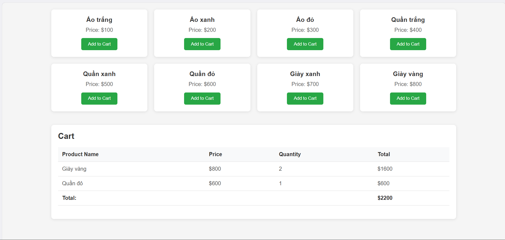

# Day 11: Giới thiệu ReactJS, JSX, Component, Props, Quy chuẩn code

## Nội dung chính

- [Tổng quan ReactJS](#tổng-quan-reactjs)
- [JSX Syntax](#jsx-syntax)
- [Functional Component](#functional-component)
- [Props và Children](#props-và-children)
- [Setup Project React](#setup-project-react)
- [Code Style Convention](#code-style-convention)

---

## Tổng quan ReactJS

**ReactJS** là một thư viện JavaScript mã nguồn mở được phát triển bởi Facebook, dùng để xây dựng giao diện người dùng (UI) cho các ứng dụng web.

- React giúp xây dựng **UI theo dạng component-based**: chia nhỏ giao diện thành các phần độc lập, tái sử dụng.
- React chỉ tập trung vào phần **View** trong mô hình **MVC**.
- Hiệu suất cao nhờ sử dụng **Virtual DOM**: chỉ cập nhật phần tử thay đổi trên giao diện, không cần render lại toàn bộ.

✅ **Ưu điểm:**
- Dễ phát triển các ứng dụng lớn.
- Tái sử dụng code tốt.
- Cộng đồng mạnh, nhiều thư viện hỗ trợ.

---

## JSX Syntax

**JSX (JavaScript XML)** là cú pháp cho phép viết HTML trực tiếp trong JavaScript.

Ví dụ JSX:
```jsx
const element = <h1>Hello, world!</h1>;
```

> JSX sẽ được **biên dịch** thành `React.createElement()` trong JavaScript thuần.

Một số lưu ý khi viết JSX:
- Một component **phải return 1 khối** duy nhất.
- Các attribute dùng **camelCase** (`className`, `onClick`, v.v.).
- Các biểu thức JavaScript trong JSX dùng `{}`.

Ví dụ:
```jsx
const name = 'Hieu';
const element = <h1>Hello, {name}</h1>;
```

---

## Functional Component

**Functional Component** là các hàm JavaScript đơn giản nhận vào **props** và trả về **JSX**.

Ví dụ một functional component:
```jsx
function Welcome(props) {
  return <h1>Hello, {props.name}</h1>;
}
```

Hoặc với **arrow function**:
```jsx
const Welcome = (props) => {
  return <h1>Hello, {props.name}</h1>;
};
```

✅ Functional Components:
- Nhẹ, đơn giản.
- Dễ kiểm soát vòng đời với **React Hooks** (sẽ học sau).

---

## Props và Children

### Props
**Props** (Properties) là các **tham số** truyền từ component cha xuống component con, dùng để cấu hình hoặc truyền dữ liệu.

Ví dụ truyền props:
```jsx
<Welcome name="Minh" />
```

Component nhận props:
```jsx
function Welcome(props) {
  return <h1>Hello, {props.name}</h1>;
}
```

### Children
`props.children` là cách để truyền **nội dung lồng bên trong component**.

Ví dụ:
```jsx
function Card(props) {
  return <div className="card">{props.children}</div>;
}

// Sử dụng
<Card>
  <h2>Title</h2>
  <p>Content</p>
</Card>
```
👉 `props.children` chứa `<h2>` và `<p>` trong ví dụ trên.

---

## Setup Project React

Cách tạo project React mới bằng **Vite** (nhẹ, nhanh hơn Create React App):

```bash
npm create vite@latest my-react-app
cd my-react-app
npm install
npm run dev
```

> 📦 Vite giúp tạo project React với cấu trúc gọn nhẹ, dễ tùy chỉnh.

**Hoặc** nếu dùng **Create React App**:

```bash
npx create-react-app my-app
cd my-app
npm start
```

---

## Code Style Convention

**Quy tắc viết code React chuẩn:**

| Quy tắc | Mô tả |
|:--------|:------|
| Component viết hoa chữ cái đầu | `Welcome`, `MyButton`, v.v. |
| Dùng arrow function cho component | Đặc biệt khi code nhiều hooks |
| Sử dụng destructuring props | `const { name } = props` thay vì `props.name` |
| Tên file theo PascalCase | Ví dụ: `MyComponent.jsx` |
| Mỗi component nằm trong 1 file riêng | Giúp quản lý rõ ràng |
| CSS riêng cho từng component | Ví dụ: `MyComponent.module.css` hoặc styled-components |
| Không để logic phức tạp trong JSX | Tách ra thành hàm nếu cần |

Ví dụ tốt:
```jsx
const Welcome = ({ name }) => {
  return <h1>Hello, {name}</h1>;
};
```

---

# 📌 Ghi chú thêm
- React sử dụng **Virtual DOM** nên cần tối ưu các component để tránh render thừa.
- Các kiến thức tiếp theo : **State, Event Handling, Lifecycle, Hooks Conditional Rendering, List & Key, Form Handling**.

---

### Demo 

### Cách chạy project
* cd vào dường dẫn gốc thư mục /reactjs/day-11
* mở cmd chạy lệnh npm install 
* Tiếp tục npm run dev
