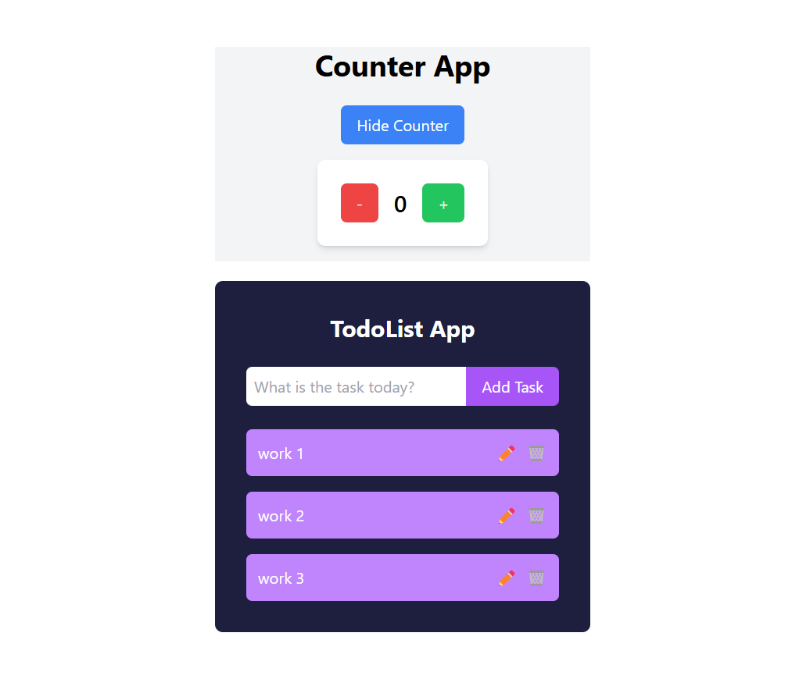

# Day 12: State, Event, Conditional Rendering, List & Key, Form Handling

## :rocket: useState Hook

State là nơi lưu trữ dữ liệu thay đổi trong component.

```jsx
import { useState } from 'react';

function Example() {
  const [count, setCount] = useState(0);
  return (
    <div>
      <p>You clicked {count} times</p>
      <button onClick={() => setCount(count + 1)}>
        Click me
      </button>
    </div>
  );
}
```

- `count`: giá trị hiện tại của state.
- `setCount`: hàm để cập nhật giá trị mới.

---

## :zap: Event Handling trong React

Xử lý sự kiện như `onClick`, `onChange`, `onSubmit`,...

```jsx
function Button() {
  function handleClick() {
    alert('You clicked me!');
  }

  return <button onClick={handleClick}>Click me</button>;
}
```

- Gán hàm trực tiếp vào prop.
- KHÔNG thêm `()` khi gán tránh gọi ngay khi render.

---

## :eyes: Conditional Rendering

Hiển thị theo điều kiện.

```jsx
function UserGreeting({ isLoggedIn }) {
  if (isLoggedIn) {
    return <h1>Welcome back!</h1>;
  } else {
    return <h1>Please sign up.</h1>;
  }
}
```

Hoặc ngắn gọn:

```jsx
return (
{isLoggedIn ? <h1>Welcome back!</h1> : <h1>Please sign up.</h1>}
)
```

Hoặc:

```jsx
return (
{isLoggedIn && <h1>Welcome back!</h1>}
)
```

---

## :bulb: Render List, sử dụng key

Render danh sách với `.map()` và phải có `key` để React quản lý tốt.

```jsx
function NumberList({ numbers }) {
  return (
    <ul>
      {numbers.map((number) => (
        <li key={number}>{number}</li>
      ))}
    </ul>
  );
}
```

- `key` phải là duy nhất.
- KHÔNG dùng `key` là prop trong component con.

---

## :pencil2: Form Input & Handle Change

Quản lý input form với state và onChange.

```jsx
function MyForm() {
  const [name, setName] = useState('');

  function handleChange(event) {
    setName(event.target.value);
  }

  function handleSubmit(event) {
    event.preventDefault();
    alert('Submitted name: ' + name);
  }

  return (
    <form onSubmit={handleSubmit}>
      <input type="text" value={name} onChange={handleChange} />
      <button type="submit">Submit</button>
    </form>
  );
}
```

- `event.target.value` là giá trị input nhập.
- `preventDefault()` để ngăn reload trang.

---

# :bookmark_tabs: Tóm tắt nhanh

| Nội dung | Tóm tắt |
|:---|:---|
| `useState` | Khởi tạo state, cập nhật giá trị |
| Event Handling | Xử lý sự kiện như click, change |
| Conditional Rendering | Render theo điều kiện |
| List & Key | Render danh sách, cần `key` duy nhất |
| Form Handling | Liên kết input với state, handle submit |

### Demo 
 
### Cách chạy project
* cd vào dường dẫn gốc thư mục /reactjs/day-12
* mở cmd chạy lệnh npm install 
* Tiếp tục npm run dev
