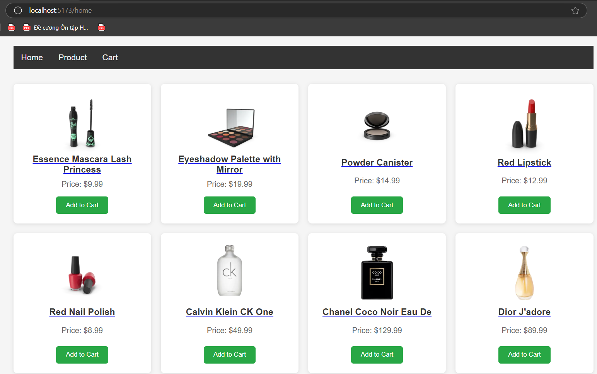
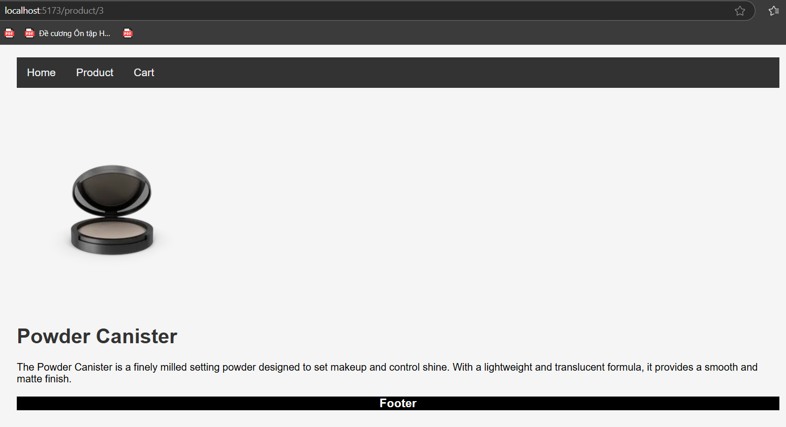
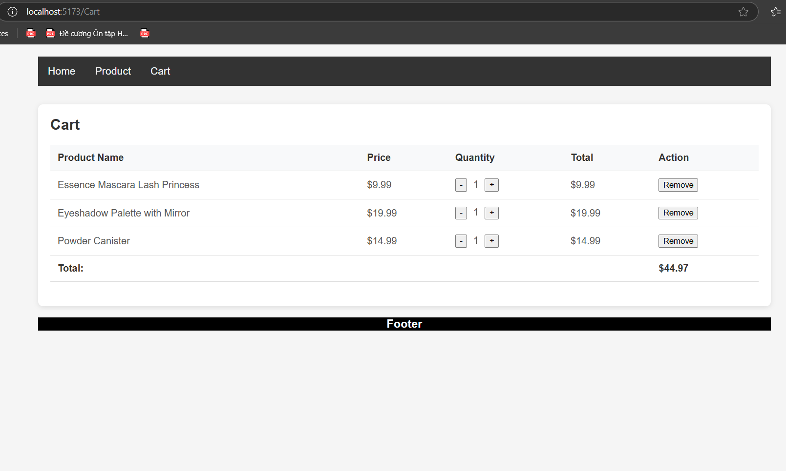

Lý thuyết về **React Router** và **useContext** trong React liên quan đến việc quản lý điều hướng (navigation) và trạng thái toàn cục (global state) trong ứng dụng Single Page Application (SPA). Dưới đây là giải thích chi tiết từng phần:

---

### 1. **Giới thiệu SPA và React Router DOM v6**

#### **SPA (Single Page Application)**
- **SPA** là ứng dụng web chỉ tải một trang HTML duy nhất từ server. Sau đó, nội dung được cập nhật động trên cùng một trang thông qua JavaScript (React trong trường hợp này) mà không cần tải lại toàn bộ trang.
- **Ưu điểm**:
  - Trải nghiệm mượt mà, nhanh hơn so với ứng dụng đa trang (MPA).
  - Giảm tải server vì chỉ tải dữ liệu cần thiết.
- **Nhược điểm**:
  - SEO phức tạp hơn (cần SSR hoặc các kỹ thuật tối ưu).
  - Thời gian tải ban đầu có thể lâu hơn nếu bundle lớn.

#### **React Router DOM v6**
- **React Router** là thư viện điều hướng phổ biến cho React, giúp quản lý các tuyến đường (routes) trong SPA.
- **Phiên bản v6** (mới nhất tính đến 2025) mang lại nhiều cải tiến:
  - API đơn giản hơn, hiệu suất tốt hơn.
  - Hỗ trợ **nested routes** mạnh mẽ hơn.
  - Cung cấp các hook như `useNavigate`, `useParams`, `useLocation` để tương tác với router.
- **Cài đặt**:
  ```bash
  npm install react-router-dom
  ```
- **Cách sử dụng cơ bản**:
  - Tạo cấu trúc route trong ứng dụng bằng `BrowserRouter`, `Routes`, và `Route`.
  ```jsx
  import { BrowserRouter, Routes, Route } from 'react-router-dom';

  function App() {
    return (
      <BrowserRouter>
        <Routes>
          <Route path="/" element={<Home />} />
          <Route path="/about" element={<About />} />
        </Routes>
      </BrowserRouter>
    );
  }
  ```

---

### 2. **Nested Routes và Dynamic Route**

#### **Nested Routes (Tuyến đường lồng nhau)**
- **Nested Routes** cho phép định nghĩa các tuyến đường con bên trong tuyến đường cha, giúp tổ chức giao diện theo cấu trúc phân cấp.
- **Ví dụ**:
  ```jsx
  function App() {
    return (
      <Routes>
        <Route path="/dashboard" element={<Dashboard />}>
          <Route path="profile" element={<Profile />} />
          <Route path="settings" element={<Settings />} />
        </Route>
      </Routes>
    );
  }
  ```
  - Trong ví dụ trên, `/dashboard/profile` sẽ render cả `Dashboard` và `Profile` (thông qua `<Outlet>`).
- **Outlet**:
  - Là một component của React Router, dùng để render nội dung của route con trong component cha.
  ```jsx
  function Dashboard() {
    return (
      <div>
        <h1>Dashboard</h1>
        <Outlet /> {/* Nội dung của route con sẽ hiển thị ở đây */}
      </div>
    );
  }
  ```

#### **Dynamic Route (Tuyến đường động)**
- **Dynamic Route** cho phép định nghĩa các tuyến đường có tham số động (dynamic parameters), ví dụ: `/users/:id`.
- **Cách sử dụng**:
  - Tham số được định nghĩa bằng dấu `:` trong path.
  - Sử dụng hook `useParams` để lấy giá trị tham số.
  ```jsx
  import { useParams } from 'react-router-dom';

  function User() {
    const { id } = useParams(); // Lấy giá trị của :id từ URL
    return <h1>User ID: {id}</h1>;
  }

  // Route
  <Route path="/users/:id" element={<User />} />
  ```
  - Ví dụ: Khi truy cập `/users/123`, component `User` sẽ hiển thị "User ID: 123".

---

### 3. **Context API - Global State**

#### **Context API**
- **Context API** là cơ chế của React để quản lý trạng thái toàn cục (global state), giúp chia sẻ dữ liệu giữa các component mà không cần truyền props qua nhiều cấp (prop drilling).
- **Khi nào sử dụng**:
  - Khi cần chia sẻ dữ liệu như thông tin người dùng, chủ đề (theme), hoặc trạng thái ứng dụng trên nhiều component.
- **Các thành phần chính**:
  - **`createContext`**: Tạo context object.
  - **`Provider`**: Cung cấp dữ liệu cho các component con.
  - **`Consumer`** hoặc **hook `useContext`**: Truy cập dữ liệu từ context.

#### **Cách sử dụng Context API**
1. **Tạo Context**:
   ```jsx
   import { createContext } from 'react';

   const MyContext = createContext();
   ```

2. **Cung cấp dữ liệu qua Provider**:
   ```jsx
   import { useState } from 'react';

   function App() {
     const [theme, setTheme] = useState('light');

     return (
       <MyContext.Provider value={{ theme, setTheme }}>
         <Main />
       </MyContext.Provider>
     );
   }
   ```

3. **Truy cập dữ liệu bằng useContext**:
   ```jsx
   import { useContext } from 'react';

   function Main() {
     const { theme, setTheme } = useContext(MyContext);

     return (
       <div>
         <h1>Theme: {theme}</h1>
         <button onClick={() => setTheme(theme === 'light' ? 'dark' : 'light')}>
           Toggle Theme
         </button>
       </div>
     );
   }
   ```

#### **Ưu điểm của Context API**
- Loại bỏ prop drilling.
- Dễ dàng quản lý trạng thái toàn cục trong ứng dụng nhỏ hoặc trung bình.
- Tích hợp tốt với các hook như `useState` và `useReducer`.

#### **Nhược điểm**
- Có thể gây ra re-render không cần thiết nếu không tối ưu (dùng memoization hoặc tách context).
- Với ứng dụng lớn, nên cân nhắc sử dụng thư viện quản lý trạng thái như Redux hoặc Zustand.

---

### Tổng kết
- **React Router DOM v6** giúp xây dựng điều hướng trong SPA với các tính năng như **nested routes** và **dynamic routes**, mang lại trải nghiệm mượt mà và tổ chức tốt hơn.
- **Context API** cung cấp cách quản lý trạng thái toàn cục đơn giản, phù hợp cho các ứng dụng nhỏ/trung bình, giúp chia sẻ dữ liệu dễ dàng giữa các component.
- Kết hợp **React Router** và **Context API**, để có thể xây dựng một SPA với điều hướng phức tạp và trạng thái được quản lý tập trung.

### Bài tập
Xây app quản lý sản phẩm có:
Trang Home
Trang Product Detail (router param)
Context quản lý Cart (add/remove)
#### Demo
trang Home

trang Detail

trang Cart


