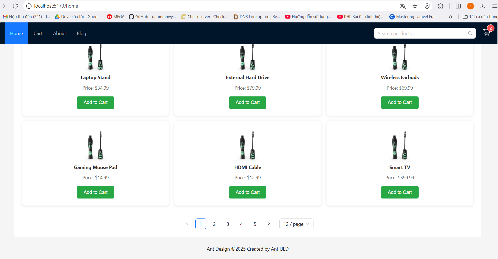
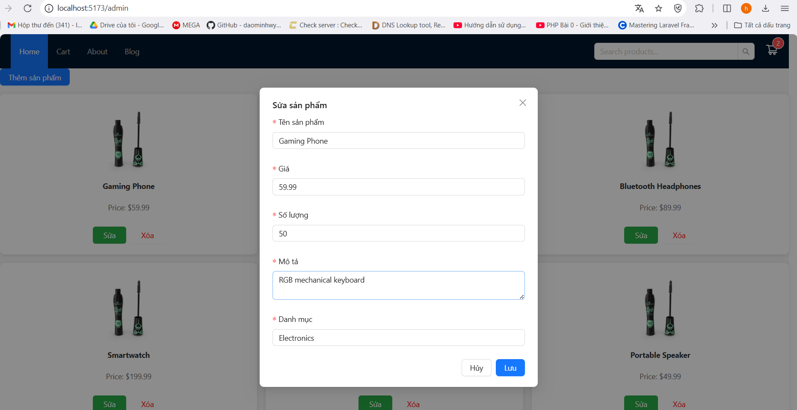
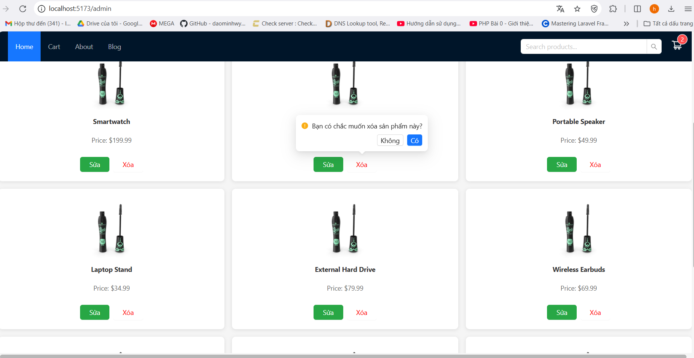
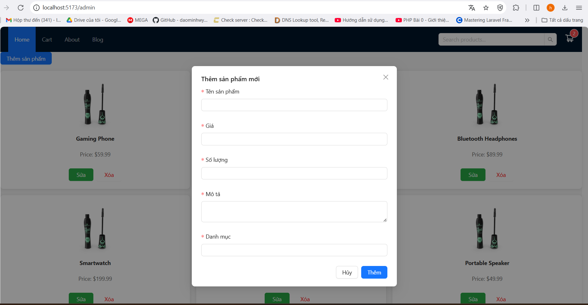
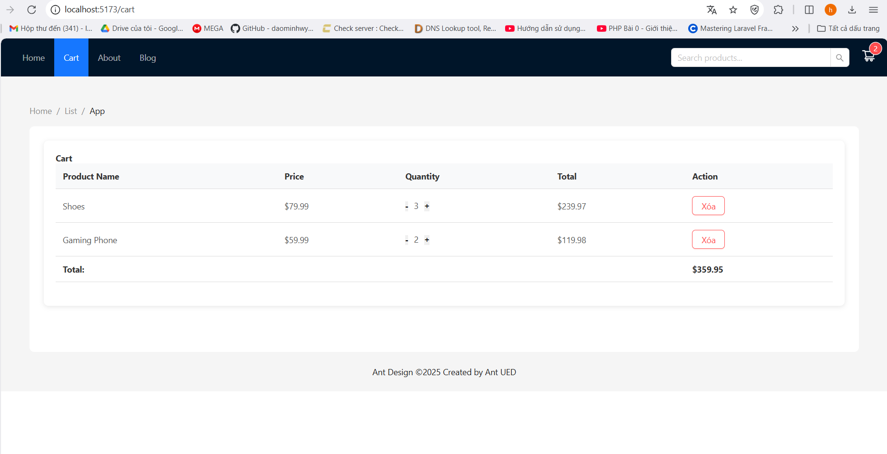

# Day 18-19-20: Mini Project Product + Cart 
## 🚀 Các Chức năng chính
#### 🔍 Trang admin quản lý sản phẩm (/admin)
Cho phép thêm, sửa, xoá, cập nhật sản phẩm.
Hiển thị danh sách sản phẩm theo trang (pagination).
#### 🛒 Giỏ hàng (/cart)
Hiển thị các sản phẩm đã thêm vào giỏ.
Cho phép cập nhật số lượng hoặc xóa sản phẩm.
Modal xác nhận khi xóa sản phẩm.
Hiển thị tổng tiền.
#### 🌐 Trang chủ (/home)
Hiển thị danh sách sản phẩm theo trang (pagination).
Cho phép tìm kiếm sản phẩm theo tên.
### 🚀 Technologies Used
* **React.js + Vite**: Framework and build tool.
* **Ant Design**: UI library.
* **React Router DOM**: Routing management.
* **useContext + useReducer**: Cart state management.
* **localStorage** : Cart data storage.
* **Custom Hook**: Reusable logic.
### Demo giao diện từng chức năng

#### Giao diện chính (trang home)

#### Admin 
* Chức năng sửa sản phẩm

* Chức năng xóa sản phẩm

* Chức năng thêm sản phẩm mới 

#### Giỏ hàng
* Giao diện chính

* xóa sản phẩm khỏi cart 
