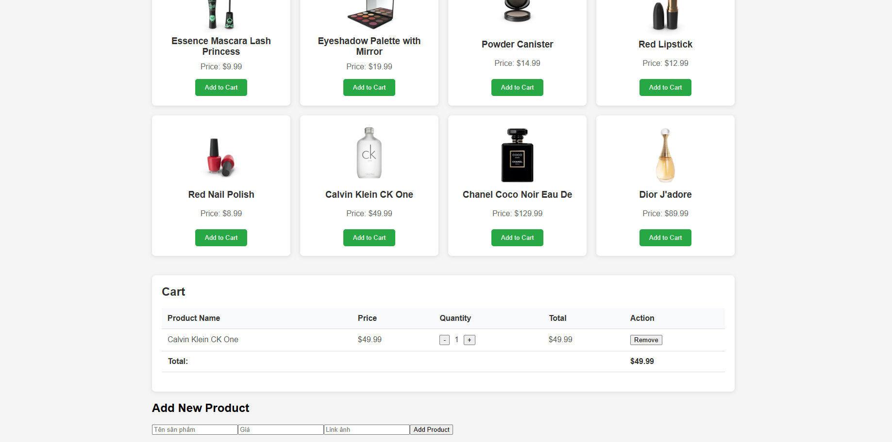

# Day 14-15: Mini Project: Xây dựng App Quản lý Product & Giỏ hàng
### Yêu cầu chức năng
##### 1. Render danh sách sản phẩm
*  Tên sản phẩm, giá, hình ảnh
##### 2. Thêm sản phẩm vào giỏ hàng
Button "Add to Cart"
##### 3. Hiển thị giỏ hàng
* Danh sách sản phẩm trong giỏ
* Tổng tiền
* Số lượng
##### 4. Thêm / Xóa / Update số lượng sản phẩm trong giỏ
##### 5. Form thêm sản phẩm mới vào danh sách
* Validate tên, giá không được để trống
##### 6. Dữ liệu lưu vào localStorage hoặc fake API

### Cách chạy project
* cd vào dường dẫn gốc thư mục /reactjs/mini-project
* mở cmd chạy lệnh npm install 
* Tiếp tục npm run dev
### Demo giao diện 
