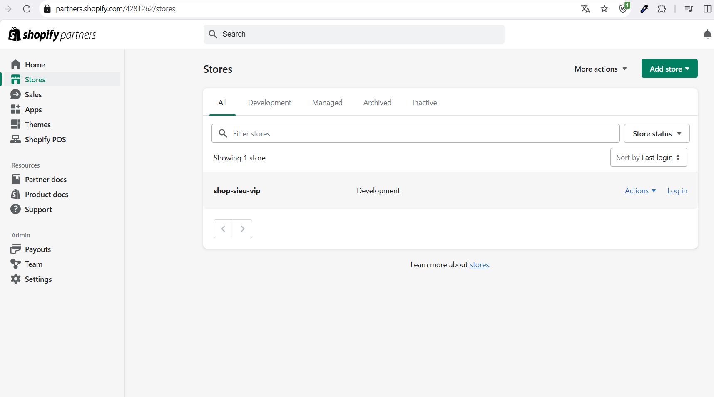
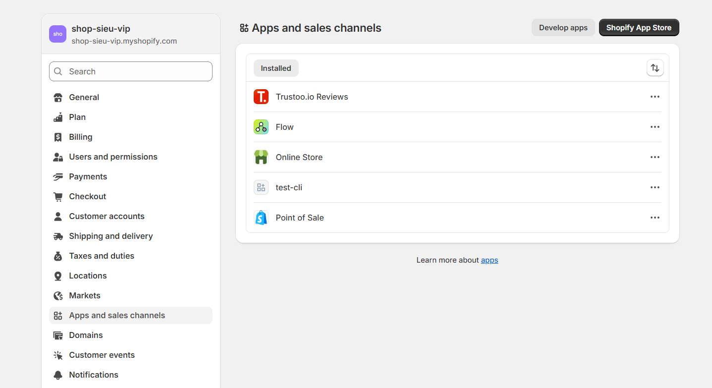
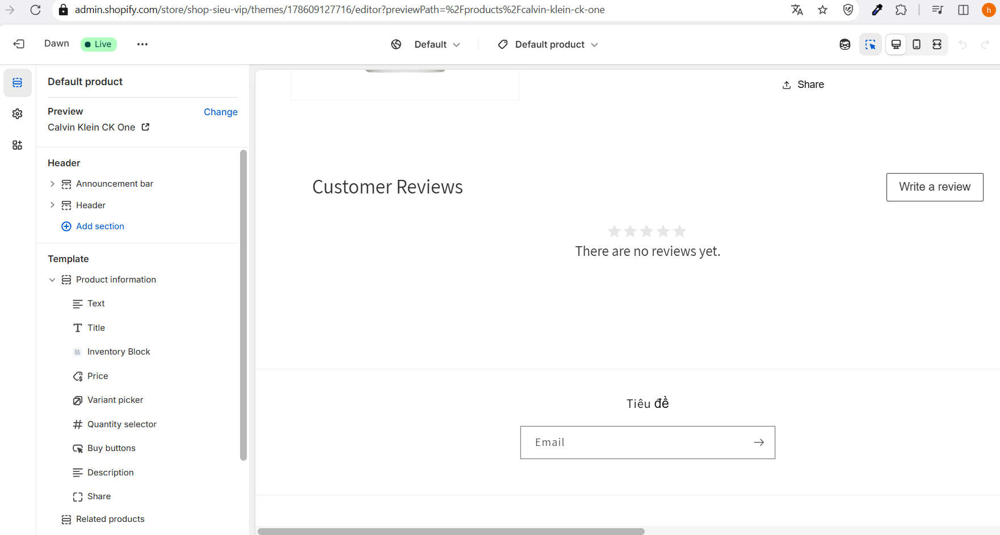

# Day 21: Tổng quan Shopify & Shopify App
## Nội dung chính
* Shopify là gì? Mô hình hoạt động
* Các loại Shopify App (Public, Private, Custom)
* Shopify Partner, Dev Store, Shopify App Store
## Bài tập
* Đăng ký Shopify Partner Account
* Tạo Dev Store đầu tiên
* Khám phá Admin Dashboard và các tính năng
* Cài thử 1 public app vào store test

### Tổng quan Shopify & Shopify App

#### 1. Shopify là gì? Mô hình hoạt động
- **Shopify** là một nền tảng thương mại điện tử cho phép người dùng tạo và quản lý cửa hàng trực tuyến dễ dàng mà không cần kỹ năng lập trình sâu. Nó cung cấp các công cụ để thiết kế website, quản lý sản phẩm, xử lý thanh toán, và theo dõi đơn hàng.
- **Mô hình hoạt động**:
  - **SaaS (Software as a Service)**: Shopify hoạt động theo mô hình thuê bao, người dùng trả phí hàng tháng để sử dụng nền tảng.
  - Cung cấp các tính năng như giao diện tùy chỉnh, tích hợp thanh toán (Shopify Payments, PayPal, v.v.), quản lý kho, và hỗ trợ SEO.
  - Hỗ trợ đa kênh bán hàng: online store, POS (Point of Sale), mạng xã hội, và marketplace (Amazon, eBay).
  - Có hệ sinh thái Shopify App Store để mở rộng chức năng cửa hàng.

#### 2. Các loại Shopify App
- **Public App**:
  - Ứng dụng được phát triển và phân phối trên Shopify App Store, dành cho tất cả người dùng Shopify.
  - Ví dụ: Ứng dụng SEO, email marketing (Klaviyo), hoặc đánh giá sản phẩm (Loox).
  - Phải tuân thủ quy định của Shopify và được phê duyệt trước khi lên store.
- **Private App**:
  - Ứng dụng được phát triển riêng cho một cửa hàng cụ thể, không công khai trên App Store.
  - Phù hợp cho các nhu cầu tùy chỉnh đặc thù, tích hợp hệ thống nội bộ.
  - Cài đặt thông qua API key và không cần phê duyệt từ Shopify.
- **Custom App**:
  - Ứng dụng được tạo qua Shopify Admin, sử dụng API để tích hợp với cửa hàng.
  - Thay thế dần Private App từ năm 2020, dễ quản lý hơn và hỗ trợ tính năng hiện đại hơn.

#### 3. Shopify Partner, Dev Store, Shopify App Store
- **Shopify Partner**:
  - Chương trình dành cho nhà phát triển, nhà thiết kế, hoặc marketer muốn xây dựng ứng dụng, theme, hoặc cung cấp dịch vụ cho Shopify merchants.
  - Lợi ích: Truy cập Dev Store miễn phí, kiếm hoa hồng qua Affiliate Program, và sử dụng công cụ phát triển.
- **Dev Store**:
  - Cửa hàng thử nghiệm miễn phí dành cho Shopify Partners để phát triển ứng dụng hoặc theme.
  - Không giới hạn số lượng Dev Store, nhưng chỉ dùng cho mục đích thử nghiệm, không bán hàng thật.
- **Shopify App Store**:
  - Nơi liệt kê các Public App và theme để người dùng Shopify cài đặt.
  - Nhà phát triển có thể kiếm tiền qua mô hình miễn phí, trả phí một lần, hoặc thuê bao định kỳ.

---

### Bài tập

1. **Đăng ký Shopify Partner Account**:
   - Truy cập [Shopify Partner Program](https://www.shopify.com/partners).
   - Nhấn “Join Now” và điền thông tin: email, mật khẩu, tên công ty/cá nhân.
   - Xác nhận email và hoàn tất đăng ký.
   - Đăng nhập vào Partner Dashboard để bắt đầu.

2. **Tạo Dev Store đầu tiên**:
   - Trong Partner Dashboard, vào mục **Stores** > **Add store**.
   - Chọn **Development store**.
   - Điền thông tin: tên cửa hàng, URL (dạng `your-store-name.myshopify.com`), và chọn khu vực.
   - Sau khi tạo, bạn sẽ có quyền truy cập vào Admin Dashboard của Dev Store.
   

3. **Khám phá Admin Dashboard và các tính năng**:
   - **Products**: Thêm/sửa sản phẩm, quản lý kho.
   - **Orders**: Xem và xử lý đơn hàng (thử tạo đơn hàng giả lập).
   - **Customers**: Quản lý thông tin khách hàng.
   - **Analytics**: Xem báo cáo hiệu suất cửa hàng.
   - **Settings**: Cấu hình thanh toán, vận chuyển, thuế, và domain.
   - Thử tùy chỉnh theme trong **Online Store** > **Themes** để thay đổi giao diện.

4. **Cài thử 1 Public App vào store test**:
  Truy cập `app.shopify.com`và Tìm kiếm và cài đặt ứng dụng `Trustoo.io` (chức năng preview trong page)
  
  Khi cài đặt thành công sẽ có chức năng preview trong page của product
  
---

