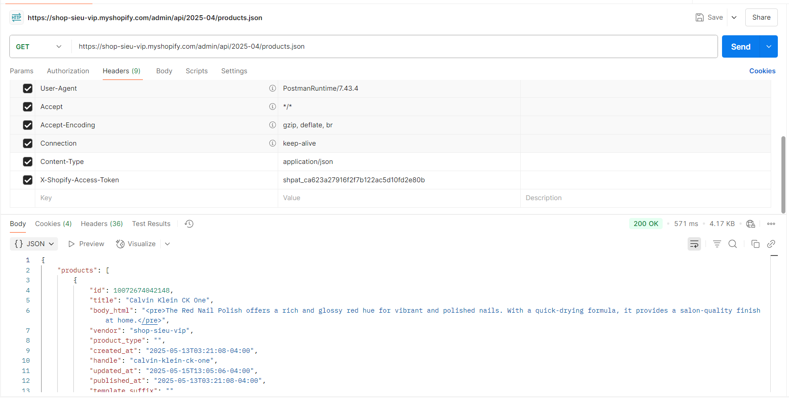
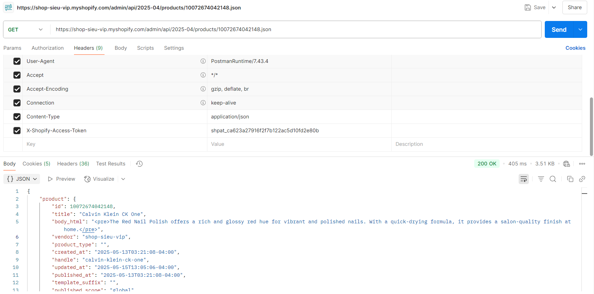
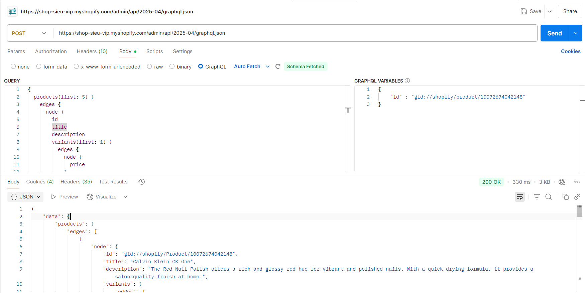

# Day 22: Shopify API Overview (REST - GraphQL)
## Nội dung chính
* REST API vs GraphQL API
* Giới thiệu các API quan trọng: Product API, Customer API, Order API
* Tìm hiểu các API mà Shopify cung cấp cho App
* Nắm được các giới hạn (rate limit, scope) khi gọi API
* Phân tích REST API vs GraphQL API
* Hiểu về Rate Limit và tính toán limit
* Phân quyền scope, xin đúng quyền API
* Các lỗi thực tế khi phát triển app:
    * Vượt limit
    * Thiếu scope  
    * Lỗi API khi thiếu dữ liệu
    * Xử lý lỗi và retry logic
* Hiểu OAuth flow cơ bản để lấy access token
* Giới thiệu Postman test Shopify API

## Bài tập
* Test API trên Postman:
* Lấy danh sách products
* Lấy thông tin 1 product
* Tìm hiểu OAuth Flow để hiểu cơ chế token
# Giải thích lý thuyết

### 1. So sánh REST vs GraphQL
| **Tiêu chí**              | **REST**                                                              | **GraphQL**                                                            |
| ------------------------- | --------------------------------------------------------------------- | ---------------------------------------------------------------------- |
| **Khái niệm**             | Kiến trúc API sử dụng HTTP method để thao tác tài nguyên              | Ngôn ngữ truy vấn dữ liệu do Facebook phát triển                       |
| **Endpoint**              | Mỗi tài nguyên là một endpoint riêng (`/users`, `/posts`)             | Một endpoint duy nhất (`/graphql`)                                     |
| **Nguyên lý**             | Dữ liệu cố định theo route và method (`GET`, `POST`, `PUT`, `DELETE`) | Client tự định nghĩa dữ liệu cần lấy hoặc gửi thông qua query/mutation |
| **Lấy dữ liệu**           | Trả toàn bộ dữ liệu tài nguyên                                        | Trả đúng dữ liệu được yêu cầu                                          |
| **Under/Over-fetching**   | Thường xảy ra (thiếu hoặc dư dữ liệu)                                 | Hạn chế tốt under/over-fetching                                        |
| **Gộp truy vấn**          | Phải gọi nhiều endpoint                                               | Gộp nhiều truy vấn trong 1 lần gọi                                     |
| **Caching**               | Hỗ trợ tốt qua HTTP cache                                             | Cần custom caching                                                     |
| **Xử lý quan hệ dữ liệu** | Khó với dữ liệu lồng nhau (nested)                                    | Tốt cho nested data, dễ query quan hệ phức tạp                         |
| **Tài liệu & công cụ**    | Swagger, Postman, Insomnia,...                                        | GraphQL Playground, GraphiQL,...                                       |
| **Học & triển khai**      | Dễ học, phổ biến, có chuẩn lâu đời                                    | Hơi khó hơn, cần server cấu hình thêm                                  |
| **Bảo mật**               | Dễ kiểm soát theo route và method                                     | Phức tạp hơn do query linh hoạt                                        |

### ✅ Ưu điểm
| REST                                | GraphQL                                            |
| ----------------------------------- | -------------------------------------------------- |
| Đơn giản, chuẩn hóa tốt             | Truy vấn linh hoạt, tối ưu băng thông              |
| Dễ dùng với HTTP cache              | Gộp nhiều dữ liệu trong 1 request                  |
| Dễ học, cộng đồng lớn               | Phù hợp front-end cần chủ động chọn trường dữ liệu |
| Hỗ trợ phân trang, lọc truyền thống | Hỗ trợ tốt dữ liệu phức tạp, nested                |

### ❌ Nhược điểm
| REST                               | GraphQL                                    |
| ---------------------------------- | ------------------------------------------ |
| Dễ under/over-fetch dữ liệu        | Không có HTTP cache mặc định               |
| Nhiều request cho dữ liệu liên kết | Cần xử lý bảo mật và phân quyền kỹ càng    |
| Mỗi tài nguyên cần endpoint riêng  | Cần schema rõ ràng và query validation tốt |


### 2. **Các API quan trọng**:
   - **Product API**: Quản lý sản phẩm (tạo, cập nhật, xóa, lấy danh sách sản phẩm/variant).
   - **Customer API**: Quản lý thông tin khách hàng (thêm, sửa, xóa, lấy danh sách khách hàng).
   - **Order API**: Quản lý đơn hàng (tạo, cập nhật trạng thái, lấy chi tiết đơn hàng).
   - **Khác**: Inventory API, Fulfillment API, Payment API, v.v. Xem chi tiết tại [Shopify Dev Docs](https://shopify.dev/docs/api).

### 3. **Giới hạn khi gọi API**:
   - **Rate Limit**:
     - **REST**: Dùng "bucket" model (leaky bucket). Mỗi cửa hàng có 40 request ban đầu, thêm 2 request/giây, tối đa 1000 request. Nếu vượt, trả về lỗi `429 Too Many Requests`.
     - **GraphQL**: Tính theo "query cost" (mỗi field có điểm, tối đa 1000 điểm/request). Giới hạn 50 điểm/giây, tối đa 1000 điểm.
   - **Scope**: Quyền truy cập API (e.g., `read_products`, `write_orders`). Phải xin đúng scope khi cài app, nếu thiếu sẽ gặp lỗi `403 Forbidden`.

4. **Xử lý lỗi và retry logic**:
   - **Vượt rate limit**:
     - Kiểm tra header `X-Shopify-Shop-Api-Call-Limit` (REST) hoặc `throttleStatus` (GraphQL).
     - Triển khai retry logic: Đợi 1-2 giây rồi thử lại.
   - **Thiếu scope**:
     - Kiểm tra scope trong OAuth flow hoặc Admin Dashboard.
     - Yêu cầu người dùng cài lại app với scope đầy đủ.
   - **Lỗi thiếu dữ liệu**:
     - Kiểm tra payload/request body, đảm bảo đúng định dạng JSON.
     - Xem log lỗi từ Shopify (e.g., `400 Bad Request`).
   - **Retry logic**:
     - Sử dụng exponential backoff (tăng thời gian chờ sau mỗi lần thất bại).
     - Giới hạn số lần retry (e.g., 3 lần).

5. **OAuth Flow cơ bản**:
   - **Mục đích**: Lấy `access_token` để gọi API thay mặt cửa hàng.
   - **Quy trình**:
     1. Redirect người dùng đến Shopify authorization URL với `client_id`, `scope`, và `redirect_uri`.
     2. Người dùng đồng ý cài app, Shopify redirect về `redirect_uri` với mã `code`.
     3. Gửi POST request đến `/admin/oauth/access_token` với `code`, `client_id`, `client_secret` để lấy `access_token`.
     4. Lưu `access_token` để gọi API.
   - Xem chi tiết tại [Shopify OAuth Docs](https://shopify.dev/docs/apps/auth/oauth).

7. **Postman và Shopify API**:
   - **Postman**: Công cụ để test API, hỗ trợ gửi request REST/GraphQL và kiểm tra response.
   - Cần: `access_token`, URL API (e.g., `https://your-store.myshopify.com/admin/api/2025-04/`).
   - Thiết lập header: `X-Shopify-Access-Token: {access_token}` (REST) hoặc `Authorization: Bearer {access_token}` (GraphQL).

---

#### Bài tập

1. **Test API trên Postman**:
* Yêu cầu Header phải có 
``` 
Content-type : application/json
X-Shopify-Access-Token : {access-token}
```
* Dùng REST API 
Lấy tất cả danh sách sản phẩm

Lấy 1 sản phẩm (10072674042148 : id của sản phẩm)

* Dùng GraphQL
Yêu cầu Header phải có 
``` 
Content-type : application/json
X-Shopify-Access-Token : {access-token}
```

2. **Tìm hiểu OAuth Flow**:
Authorization Code Flow Quy trình này gồm 5 bước chính:
**Bước 1**: Người dùng yêu cầu ứng dụng bên thứ ba truy cập tài nguyên Người dùng bắt đầu bằng cách chọn một chức năng trong ứng dụng bên thứ ba yêu cầu quyền truy cập tài nguyên của họ, ví dụ: "Đăng nhập với Google".

Ứng dụng sẽ chuyển hướng người dùng tới máy chủ ủy quyền của dịch vụ (ví dụ: Google, Facebook).

**Bước 2**: Người dùng đăng nhập và cấp quyền Máy chủ ủy quyền yêu cầu người dùng đăng nhập và cấp quyền truy cập vào tài nguyên của mình. Người dùng có thể đồng ý hoặc từ chối yêu cầu này.

Nếu người dùng đồng ý, máy chủ ủy quyền sẽ gửi mã ủy quyền (Authorization Code) về ứng dụng bên thứ ba.

**Bước 3**: Ứng dụng gửi mã ủy quyền đến Authorization Server Ứng dụng bên thứ ba gửi mã ủy quyền (Authorization Code) nhận được ở bước trước đến Authorization Server để yêu cầu mã truy cập (Access Token).

Yêu cầu này được gửi qua một yêu cầu POST, và trong đó ứng dụng sẽ gửi thêm Client ID và Client Secret của mình để xác thực.

**Bước 4**: Authorization Server cấp Access Token Máy chủ ủy quyền sẽ xác minh mã ủy quyền và các thông tin xác thực của ứng dụng (Client ID và Client Secret). Nếu thông tin hợp lệ, máy chủ ủy quyền sẽ trả về một Access Token (và đôi khi cả một Refresh Token).

Access Token là mã thông báo mà ứng dụng sẽ sử dụng để truy cập tài nguyên người dùng trên Resource Server.

**Bước 5**: Ứng dụng sử dụng Access Token để truy cập tài nguyên Ứng dụng sử dụng Access Token để gửi yêu cầu tới Resource Server. Resource Server sẽ xác minh tính hợp lệ của token và nếu hợp lệ, sẽ cung cấp tài nguyên yêu cầu.

