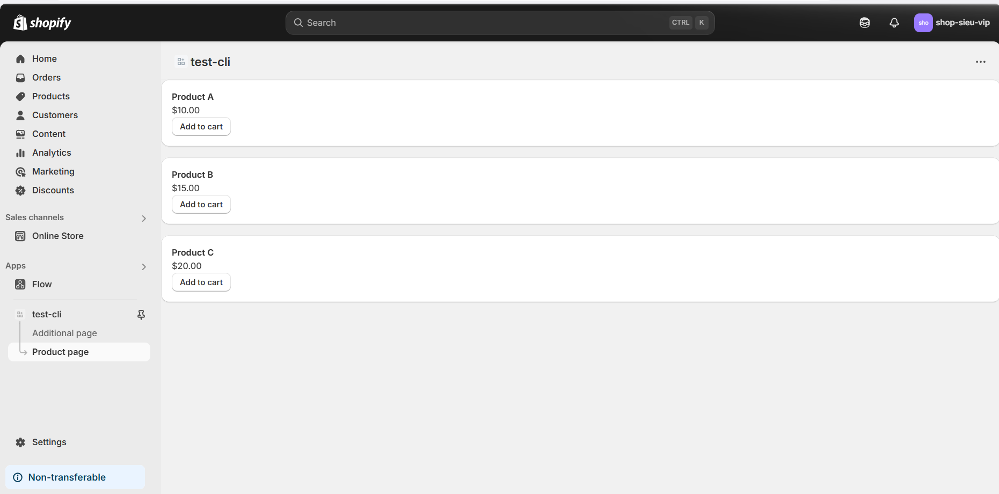

# Day 23:  Làm quen Shopify CLI & Tạo App Mẫu
Nội dung chính
* Cài đặt Shopify CLI
* Khởi tạo Project App bằng CLI
* Tìm hiểu cấu trúc folder project
Bài tập
* Tạo App mẫu chạy local
* Cài Polaris hiển thị 1 UI component mẫu (Button, Card)

#### Giải thích lý thuyết
1. **Cài đặt Shopify CLI**:
   - **Shopify CLI** là công cụ dòng lệnh giúp phát triển ứng dụng, theme, và tự động hóa các tác vụ trên Shopify.
   - **Yêu cầu**:
     - Node.js (phiên bản 16.x hoặc cao hơn, khuyến nghị LTS). Tải tại [nodejs.org](https://nodejs.org/).
     - npm (đi kèm với Node.js) hoặc Yarn.
     - Hệ điều hành: Windows, macOS, hoặc Linux.
   - **Cài đặt Shopify CLI**:
     - Mở terminal và chạy:
       ```bash
       npm install -g @shopify/cli @shopify/app
       ```
       hoặc nếu dùng Yarn:
       ```bash
       yarn global add @shopify/cli @shopify/app
       ```
     - Kiểm tra cài đặt:
       ```bash
       shopify version
       ```
       Kết quả sẽ hiển thị phiên bản CLI (e.g., `3.x.x`).
     - Đăng nhập vào Shopify Partner:
       ```bash
       shopify auth login
       ```
       Mở trình duyệt, đăng nhập vào Partner Dashboard, và cấp quyền.

2. **Khởi tạo Project App bằng CLI**:
   - Tạo một ứng dụng mẫu:
     ```bash
     shopify app init
     ```
   - CLI sẽ hỏi:
     - Tên ứng dụng (e.g., `my-shopify-app`).
     - Loại ứng dụng (chọn Node.js hoặc Ruby, khuyến nghị Node.js cho người mới).
     - Tổ chức (chọn Shopify Partner organization từ tài khoản của bạn).
   - Sau khi chạy, CLI tạo một thư mục với tên ứng dụng và cài đặt các dependency cần thiết.
   - Chạy ứng dụng local:
     ```bash
     cd my-shopify-app
     shopify app dev
     ```
     - CLI tạo tunnel (dùng ngrok) để chạy app local và cung cấp URL tạm thời (e.g., `https://abc123.ngrok.io`).
     - Đăng nhập vào Dev Store và cài ứng dụng mẫu.

3. **Tìm hiểu cấu trúc folder project**:
   - Cấu trúc cơ bản của project Shopify App (Node.js):
     ```
     my-shopify-app/
     ├── app/                     # Code chính của ứng dụng
     │   ├── routes/             # Các route xử lý logic (API, webhook)
     │   ├── models/             # Mô hình dữ liệu (nếu có)
     │   └── templates/          # File giao diện (nếu dùng server-side rendering)
     ├── web/                    # Backend logic
     │   ├── index.js           # Entry point của backend
     │   └── middleware/        # Middleware xử lý request
     ├── shopify.app.toml        # File cấu hình ứng dụng (API key, scopes, etc.)
     ├── package.json            # Quản lý dependency và script
     └── .env                    # File lưu biến môi trường (API key, secret, etc.)
     ```
   - **File quan trọng**:
     - `shopify.app.toml`: Cấu hình app (scopes, redirect URLs, webhook).
     - `.env`: Lưu `SHOPIFY_API_KEY`, `SHOPIFY_API_SECRET`, và `SCOPES`.
     - `web/index.js`: Xử lý logic backend, tích hợp OAuth và API.

---

#### Bài tập

1. **Tạo App mẫu chạy local**:
```
cd đến thư mục test-cli
Sau đó chạy lệnh npm run dev
```
2. **Cài Polaris và hiển thị 1 UI component mẫu (Button, Card)**:
   - **Shopify Polaris**: Thư viện UI của Shopify, cung cấp các component chuẩn (Button, Card, Modal, v.v.) để xây dựng giao diện ứng dụng.
   - **Cài đặt Polaris**:
     - Trong thư mục project (`my-sample-app`), chạy:
       ```bash
       npm install @shopify/polaris
       ```
       hoặc:
       ```bash
       yarn add @shopify/polaris
       ```
     - Thêm CSS của Polaris vào file chính (e.g., `web/frontend/App.jsx` nếu dùng React):
       ```jsx
       import '@shopify/polaris/build/esm/styles.css';
       ```
   - **Tạo component mẫu**:
     tạo file app.product.jsx trong thư mục app/routes

```jsx
// test-cli/app/routes/app.product.jsx
import { Button, Card, Text, Box, Layout } from "@shopify/polaris";
import React from "react";

const products = [
  { id: 1, name: "Product A", price: "$10.00" },
  { id: 2, name: "Product B", price: "$15.00" },
  { id: 3, name: "Product C", price: "$20.00" },
];

export default function product() { 

  const handleAddToCart = (product) => {
    alert(product.name);
  };

  return (
    <>
      <Layout>
        {products.map((product) => (
          <Layout.Section key={product.id} oneThird>
            <Card>
                <Box>
                  <Text as="h3" variant="headingSm">
                    {product.name}
                  </Text>
                  <Text variant="bodyMd" color="subdued">
                    {product.price}
                  </Text>
                </Box>
                <Button onClick={() => handleAddToCart(product)}>Add to cart</Button>
              
            </Card>
          </Layout.Section>
        ))}
      </Layout>
    </>
  );
}

```
   - **Chạy lại ứng dụng**:
     ```bash
     shopify app dev
     ```
   - **Kết quả**:
     

---

