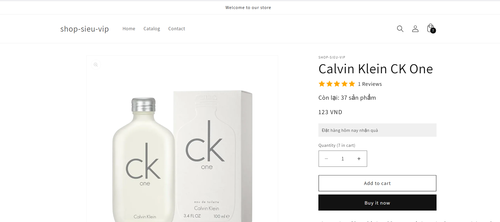
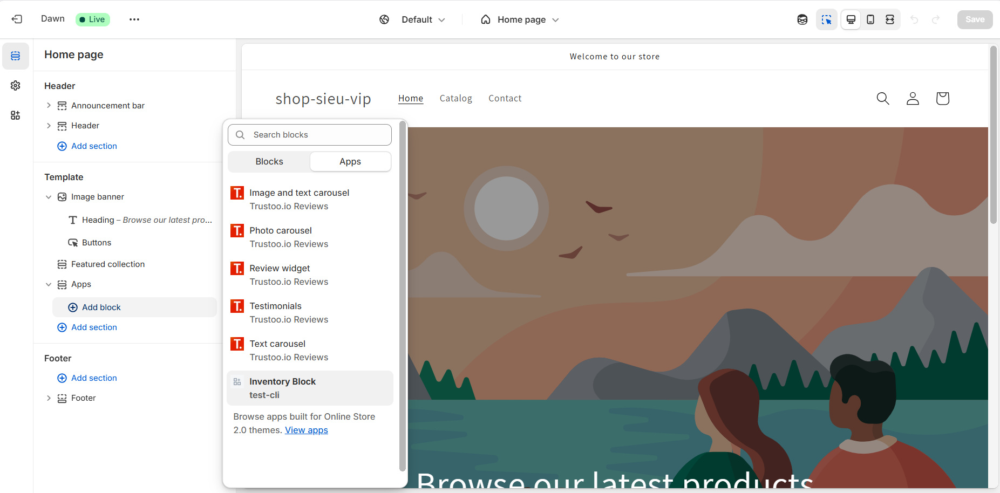

# Day 24: Shopify Theme & Storefront Interaction
### Nội dung chính
* Tổng quan Shopify Theme - Liquid, Sections, JSON Template
* Cách App tương tác với Storefront
* Cài đặt ScriptTag, App Block vào Theme
### Bài tập
* Inject 1 ScriptTag vào theme product page (hiển thị message "Đặt hàng hôm nay nhận quà")
* Thêm 1 App Block vào Product Page, hiển thị data từ App (ví dụ: tồn kho từ API riêng)

### Giải thích lý thuyết

1. **Tổng quan Shopify Theme - Liquid, Sections, JSON Template**:
   - **Shopify Theme**: Bộ mã nguồn (HTML, CSS, JavaScript, Liquid) định dạng giao diện cửa hàng trực tuyến.
     - **Liquid**: Ngôn ngữ template của Shopify, dùng để render dữ liệu động (e.g., `{{ product.title }}`).
     - **Sections**: Các khối giao diện có thể tái sử dụng, chỉnh sửa qua Theme Editor (e.g., header, footer, product page).
     - **JSON Templates**: File cấu hình (`*.json`) định nghĩa layout và settings của sections, thay thế dần các template Liquid truyền thống.
   - Theme được quản lý trong **Online Store > Themes** trong Shopify Admin hoặc qua Shopify CLI.

2. **Cách App tương tác với Storefront**:
   - **ScriptTag**: Chèn JavaScript vào storefront để thêm chức năng (e.g., pop-up, tracking code).
     - Dùng ScriptTag API (`/admin/api/2025-04/script_tags.json`) để inject script động.
     - Script chạy trên toàn bộ hoặc một số trang cụ thể (e.g., product page).
     - Dể hiểu hơn là import 1 thẻ script vào trong trang và sẽ host file js đó lên 1 server khác kiểu như thế này 
     
   - **App Block**: Một block trong theme (dùng JSON Templates) để hiển thị nội dung từ app (e.g., widget, custom UI).
     - Được thêm qua Theme Editor hoặc App Extensions.
     - Yêu cầu cấu hình trong `shopify.app.toml` và publish qua Shopify CLI.
   - **Storefront API**: Dùng GraphQL để lấy dữ liệu storefront (e.g., sản phẩm, giỏ hàng) mà không cần truy cập Admin API.

3. **Cài đặt ScriptTag, App Block vào Theme**:
   - **ScriptTag**:
     - Tạo file JS (host trên server hoặc CDN).
     - Gọi API để thêm ScriptTag vào theme, chỉ định trang (e.g., `product`).
   - **App Block**:
     - Định nghĩa block trong file `blocks/*.liquid` và cấu hình trong `shopify.app.toml`.
     - Push block lên theme qua CLI và cho phép người dùng thêm block qua Theme Editor.

---

#### Bài tập

1. **Inject 1 ScriptTag vào theme product page (hiển thị message "Đặt hàng hôm nay nhận quà")**:
   - **Chuẩn bị**:
     - Đảm bảo đã có Dev Store và Custom App với `write_script_tags` scope.
     - Tạo file `script.js` với nội dung:
       ```javascript
       // script.js
       document.addEventListener('DOMContentLoaded', function () {
         if (window.location.pathname.includes('/products/')) {
           const message = document.createElement('div');
           message.style.background = '#f0f0f0';
           message.style.padding = '10px';
           message.style.margin = '10px 0';
           message.textContent = 'Đặt hàng hôm nay nhận quà';
           const productForm = document.querySelector('form[action*="/cart/add"]');
           if (productForm) {
             productForm.prepend(message);
           }
         }
       });
       ```
     - Host `script.js` trên server hoặc CDN (e.g., dùng GitHub Pages, Firebase Hosting, hoặc server local với ngrok).
   - **Bước thực hiện**:
     - Dùng Postman hoặc code để gửi POST request đến ScriptTag API:
       ```bash
       POST https://your-store.myshopify.com/admin/api/2025-04/script_tags.json
       Header: X-Shopify-Access-Token: {access_token}
       Body:
       ```json
       {
         "script_tag": {
           "event": "onload",
           "src": "https://your-server.com/script.js",
           "display_scope": "product"
         }
       }
       ```
     - **Kết quả**
     

#### 2. Thêm 1 App Block vào Product Page, hiển thị data từ App (ví dụ: tồn kho từ API riêng)**:
`source trong day-23/test-cli/extentions/app-block`
##### Bước 1: Tạo Theme App Extension
1. **Khởi tạo extension**:
   - Trong thư mục project (e.g., `my-sample-app`), chạy:
     ```bash
     shopify app extension create
     ```
   - Chọn **Theme App Extension** khi được hỏi.
   - Đặt tên extension (e.g., `stock-display-extension`).
   - CLI sẽ tạo thư mục `extensions/stock-display-extension` với cấu trúc:
     ```
     extensions/
     └── stock-display-extension/
         ├── blocks/
         │   └── stock-display.liquid
         ├── locales/
         │   └── en.default.json
         └── shopify.app.toml
     ```


3. **Tạo App Block**:
   - Mở file `extensions/stock-display-extension/blocks/stock-display.liquid` và thêm code:
        ```liquid
        <div class="inventory-block">
        <h3 id="inventory-status"></h3>
        </div>

        <script>
        let productId = {{ product.id | default: 0 }};
        if (productId > 100) {
            productId = productId % 100;
        }
        if (productId === 0) {
            productId = 1;
        }

        fetch(`https://dummyjson.com/products/${productId}`)
            .then(response => response.json())
            .then(data => {
            document.getElementById('inventory-status').innerText = `Còn lại: ${data.stock} sản phẩm`;
            })
            .catch(error => {
            console.error('Fetch error:', error);
            document.getElementById('inventory-status').innerText = 'Lỗi khi tải dữ liệu tồn kho';
            });
        </script>

        
        {
        "name": "Inventory Block",
        "target": "section",
        "settings": []
        }
        

```
   - **Giải thích**:
     - ``: Định nghĩa block, cho phép thêm vào section (như Product Page) qua Theme Editor.
     - `settings.product_id`: Lấy `product.id` từ Liquid để truyền vào API.
     - `<script>`: Gọi API để lấy dữ liệu tồn kho và hiển thị.

```
Sau đó chạy lệnh 
```bash
shopify app deploy
```
Sau khi chạy thành công . Khi vào Custom theme trong Online store và ấn add một block sẽ hiện 

