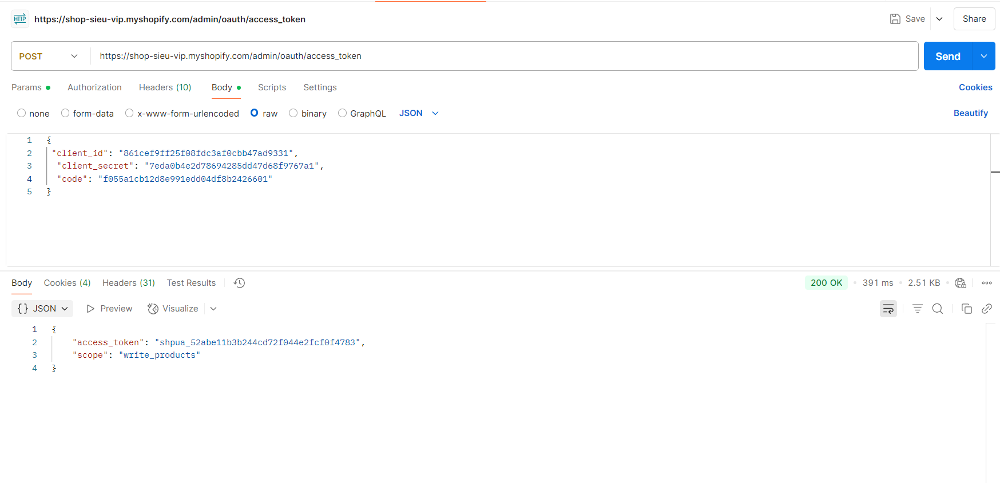
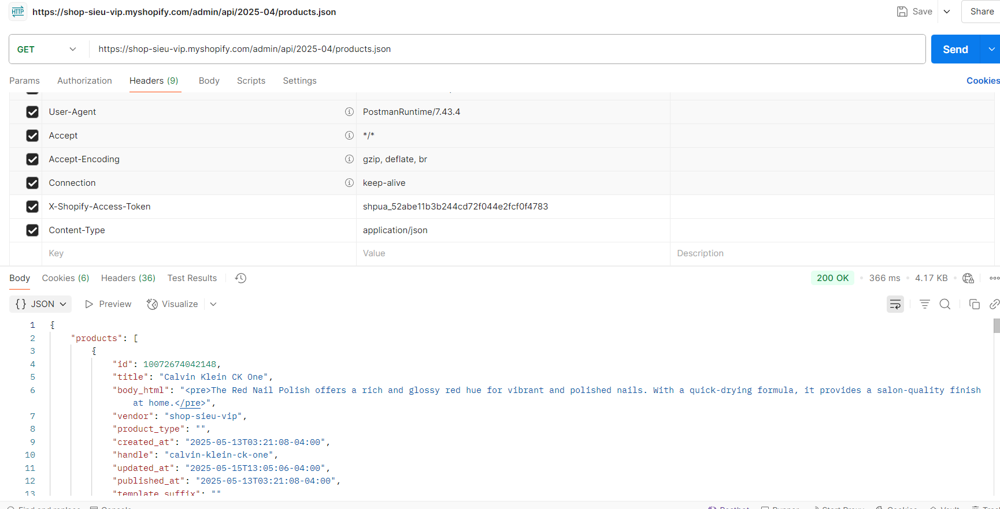

### Day 25: OAuth Flow & Admin API

#### Nội dung chính

1. **Hiểu OAuth 2.0 Flow trong Shopify App**:
   - **OAuth 2.0** là giao thức xác thực cho phép ứng dụng truy cập dữ liệu Shopify thay mặt người dùng (merchant).
   - **Quy trình OAuth trong Shopify**:
     1. **Authorization Request**: Redirect người dùng đến Shopify để cấp quyền cài app.
        - URL: `https://{shop}.myshopify.com/admin/oauth/authorize?client_id={api_key}&scope={scopes}&redirect_uri={redirect_uri}&state={nonce}`
        - `{shop}`: Tên store (e.g., `my-store`).
        - `{api_key}`: Lấy từ Custom App hoặc Partner Dashboard.
        - `{scopes}`: Quyền truy cập (e.g., `read_products,write_orders`).
        - `{redirect_uri}`: URL callback của app.
        - `{nonce}`: Chuỗi ngẫu nhiên để chống CSRF.
     2. **User Approval**: Người dùng đồng ý cài app trong Shopify Admin.
     3. **Authorization Code**: Shopify redirect về `{redirect_uri}` với query param `code`.
     4. **Exchange for Access Token**: Gửi POST request để đổi `code` lấy `access_token`.
        - Endpoint: `https://{shop}.myshopify.com/admin/oauth/access_token`
        - Body: `{ "client_id": "{api_key}", "client_secret": "{api_secret}", "code": "{code}" }`
     5. **Use Access Token**: Gọi Admin API với header `X-Shopify-Access-Token: {access_token}`.
   - **Lưu ý**: `access_token` là vĩnh viễn (cho đến khi app bị gỡ), lưu trữ an toàn trong database.

2. **Lấy Access Token thủ công**:
   - **Bước 1**: Tạo Custom App trong Dev Store:
     - Vào **Apps > Develop apps > Create an app**.
     - Đặt tên app, chọn scope (e.g., `read_products`).
     - Lấy `api_key` và `client_secret` từ tab **API credentials**.
   - **Bước 2**: Tạo URL authorize:
     - Ví dụ: `https://my-store.myshopify.com/admin/oauth/authorize?client_id=your_api_key&scope=read_products&redirect_uri=https://your-app.com/callback&state=nonce123`
     - Mở URL trong trình duyệt, đồng ý cài app.
   - **Bước 3**: Lấy `code` từ redirect:
     - Shopify redirect về `https://your-app.com/callback?code={code}&shop=my-store.myshopify.com&state=nonce123`.
     - Ghi lại `code` và kiểm tra `state` khớp với `nonce123`.
   - **Bước 4**: Đổi `code` lấy `access_token`:
     - Dùng Postman gửi POST request:
       ```
       POST https://my-store.myshopify.com/admin/oauth/access_token
       Content-Type: application/json
       Body:
       {
         "client_id": "your_api_key",
         "client_secret": "your_client_secret",
         "code": "your_code"
       }
       ```
     - Response: `{ "access_token": "shpat_xxx", "scope": "read_products" }`
     - Lưu `access_token` để dùng cho API calls.

3. **Gọi thử API: GET /admin/api/2024-01/products.json**:
   - **Mục đích**: Lấy danh sách sản phẩm từ Dev Store.
   - **Yêu cầu**:
     - `access_token` từ bước trên.
     - Scope `read_products`.
   - **Gửi request qua Postman**:
     - Phương thức: GET
     - URL: `https://my-store.myshopify.com/admin/api/2024-01/products.json`
     - Header: `X-Shopify-Access-Token: shpat_xxx`
     - Response: JSON chứa danh sách sản phẩm (e.g., `{ "products": [...] }`).
   - **Lưu ý**: Nếu dùng phiên bản API khác (e.g., `2025-04`), thay đổi endpoint tương ứng.

4. **Cơ chế xác thực và bảo mật của Shopify App**:
   - **Xác thực**:
     - Mỗi request Admin API cần header `X-Shopify-Access-Token`.
     - Token được cấp riêng cho mỗi store, không dùng chung.
   - **Bảo mật**:
     - Lưu `access_token` trong database an toàn (mã hóa, tránh hardcode).
     - Sử dụng HTTPS cho tất cả request.
     - Kiểm tra `state` trong OAuth để chống CSRF.
     - Xử lý rate limit (40 request ban đầu, 2 request/giây, lỗi `429 Too Many Requests` nếu vượt).
     - Webhook HMAC verification: Kiểm tra chữ ký HMAC trong header `X-Shopify-Hmac-Sha256` để đảm bảo webhook hợp lệ.
   - **Scope Management**:
     - Chỉ xin scope cần thiết để tránh bị từ chối bởi merchant.
     - Nếu thiếu scope, API trả lỗi `403 Forbidden`.

---

#### Bài tập

1. **Lấy Access Token thủ công**:
   - Tạo Custom App trong Dev Store (scope: `read_products`).
   - Tạo URL authorize mẫu và mở trong trình duyệt:
     ```bash
     https://your-store.myshopify.com/admin/oauth/authorize?client_id=your_api_key&scope=read_products&redirect_uri=https://your-app.com/callback&state=nonce123
     ```
     ```
        https://admin.shopify.com/store/shop-sieu-vip/oauth/authorize?client_id=861cef9ff25f08fdc3af0cbb47ad9331&scope=read_products&redirect_uri=https://affecting-gibraltar-allow-glasses.trycloudflare.com/auth/callback
     ```
    - Link redirect url : `https://affecting-gibraltar-allow-glasses.trycloudflare.com/auth/callback` được lấy từ file **shopify.app.toml** trong source code app
   - Sau đó trình duyệt sẽ tự động redirect url sang trang mới 
   ```
    http://affecting-gibraltar-allow-glasses.trycloudflare.com/auth/callback?code=f055a1cb12d8e991edd04df8b2426601&hmac=2913af54629906a5ffc64dcf70094d23e84891add7677fbdd0cdc267ed6dde11&host=YWRtaW4uc2hvcGlmeS5jb20vc3RvcmUvc2hvcC1zaWV1LXZpcA&shop=shop-sieu-vip.myshopify.com&timestamp=1747410127
   ```
   - Lấy mã code cho vào body Postman để thực hiện request tiếp theo
   
   - Lưu `access_token` vào file `.env` hoặc database.

2. **Gọi API GET /admin/api/2024-01/products.json**:
   - Mở Postman, tạo request:
     - Lấy access token vừa nhận được cho vào header
     - Phương thức: GET
     - URL: `https://your-store.myshopify.com/admin/api/2024-01/products.json`
     - Header: `X-Shopify-Access-Token: shpua_52abe11b3b244cd72f044e2fcf0f4783`
     
    


---

#### Lưu ý
- **API Version**: Phải dùng đúng phiên bản API .  Bài tập dùng `2024-01`. Để dùng phiên bản mới nhất (`2025-04`), thay đổi endpoint tương ứng.
- **Debug lỗi**:
  - Lỗi `401 Unauthorized`: Kiểm tra `access_token` hoặc scope.
  - Lỗi `429 Too Many Requests`: Chờ và retry sau 1-2 giây.
  - Lỗi `403 Forbidden`: Kiểm tra scope trong Custom App.
- **Công cụ hỗ trợ**:
  - Dùng Postman để test API.
  - Nếu muốn tích hợp vào app, thêm OAuth flow vào code (xem `web/index.js` từ source code **day-23**).
- **Tài liệu tham khảo**:
  - [Shopify Admin API](https://shopify.dev/docs/api/admin-rest)
  - [OAuth Flow](https://shopify.dev/docs/apps/auth/oauth)
