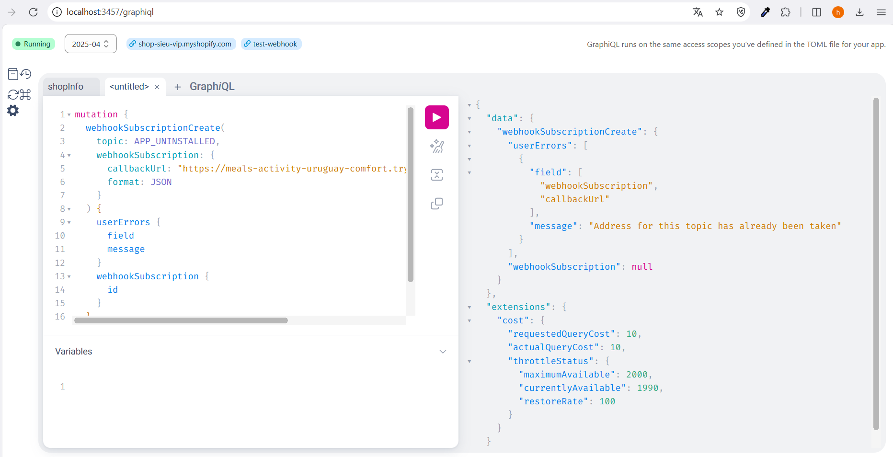
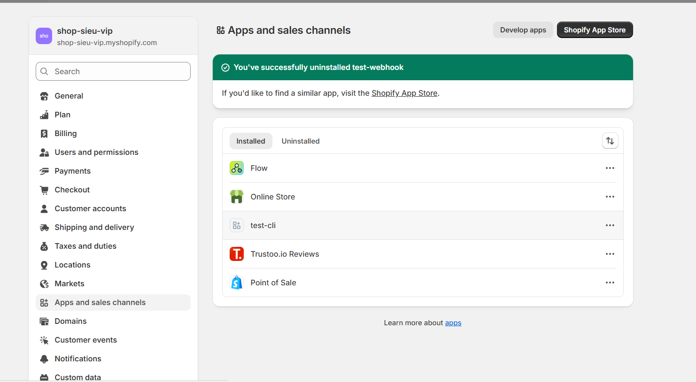
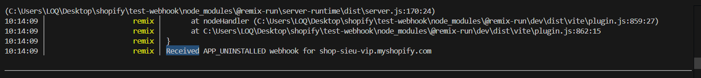
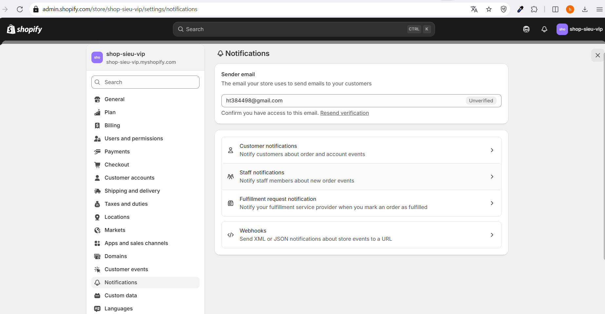
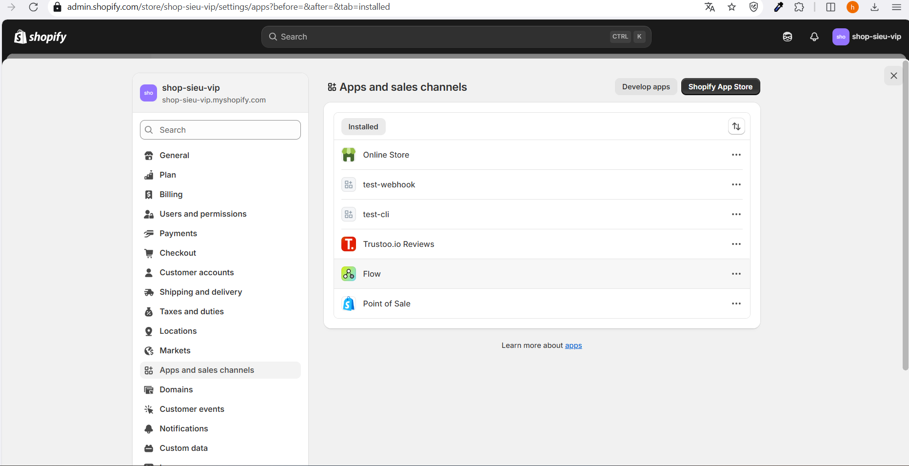
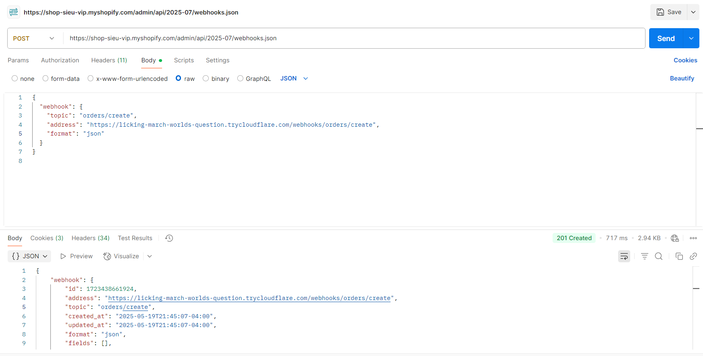
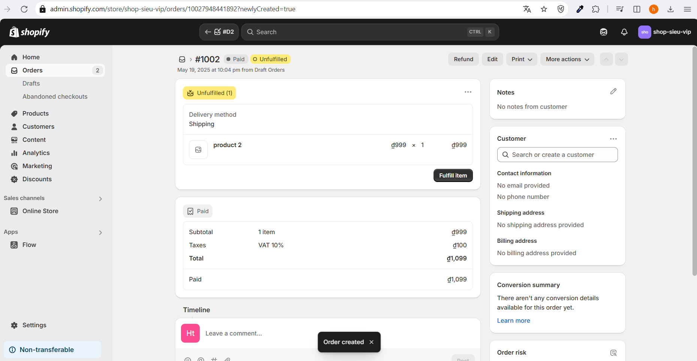
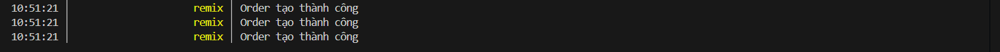

# Day 27: Shopify Webhooks
## Nội dung chính
* Tổng quan về Webhook trong Shopify
* Đăng ký webhook (REST & GraphQL)
* Xử lý webhook trong Remix App
* Các webhook quan trọng: orders/create, app/uninstalled
## Bài tập
* Đăng ký webhook orders/create
* Log dữ liệu webhook nhận được ra console

---
### 1. **Tổng quan về Webhook trong Shopify**

**Webhook** là một cơ chế cho phép Shopify gửi thông báo HTTP (thường là POST request) đến một URL cụ thể trong ứng dụng của bạn khi một sự kiện nhất định xảy ra trong cửa hàng Shopify. Điều này giúp ứng dụng phản hồi theo thời gian thực với các thay đổi như đơn hàng mới, sản phẩm được cập nhật, hoặc ứng dụng bị gỡ cài đặt.

#### Đặc điểm chính của Shopify Webhooks:
- **Sự kiện-driven**: Webhooks được kích hoạt bởi các sự kiện cụ thể (ví dụ: `orders/create`, `app/uninstalled`).
- **Payload**: Mỗi webhook gửi một JSON payload chứa thông tin chi tiết về sự kiện (ví dụ: thông tin đơn hàng, sản phẩm).
- **Tính bảo mật**: Shopify sử dụng HMAC (Hash-based Message Authentication Code) để xác minh tính xác thực của webhook.
- **Tính linh hoạt**: Có thể đăng ký qua **REST API**, **GraphQL API**, hoặc **Shopify Admin**.

#### Lợi ích:
- Cho phép ứng dụng phản ứng tức thời với các thay đổi trong cửa hàng.
- Giảm sự phụ thuộc vào việc thăm dò (polling) API định kỳ.
- Hỗ trợ tự động hóa quy trình (ví dụ: gửi email khi có đơn hàng mới).

#### Các sự kiện webhook phổ biến:
- `orders/create`: Kích hoạt khi một đơn hàng mới được tạo.
- `app/uninstalled`: Kích hoạt khi ứng dụng bị gỡ khỏi cửa hàng.
- `products/update`: Kích hoạt khi sản phẩm được cập nhật.
- `customers/create`: Kích hoạt khi khách hàng mới được tạo.

---

### 2. **Đăng ký Webhook (REST & GraphQL)**

Để nhận thông báo từ Shopify, bạn cần **đăng ký webhook** bằng cách chỉ định sự kiện và URL mà Shopify sẽ gửi yêu cầu đến. Shopify hỗ trợ đăng ký qua **REST API** và **GraphQL API**. Dưới đây là cách thực hiện trong một ứng dụng Remix.

#### a. **Đăng ký Webhook qua REST API**
- Sử dụng `@shopify/shopify-api` để đăng ký webhook.
- Thêm đoạn code sau vào file khởi tạo ứng dụng (thường là `shopify.server.js` hoặc một route khởi tạo):

```javascript
import { shopifyApi, LATEST_API_VERSION } from "@shopify/shopify-api";
import { restResources } from "@shopify/shopify-api/rest/admin/2023-10";

const shopify = shopifyApi({
  apiKey: process.env.SHOPIFY_API_KEY,
  apiSecretKey: process.env.SHOPIFY_API_SECRET,
  scopes: process.env.SCOPES.split(","),
  hostName: process.env.HOST.replace(/https?:\/\//, ""),
  apiVersion: LATEST_API_VERSION,
  isEmbeddedApp: true,
  restResources,
});

export async function registerWebhooks(session) {
  const webhookUrl = `${process.env.HOST}/webhooks`;

  const webhook = new shopify.rest.Webhook({ session });
  webhook.address = webhookUrl;
  webhook.topic = "orders/create";
  webhook.format = "json";
  await webhook.save({
    update: true,
  });

  console.log("Registered webhook for orders/create");
}
```

- Gọi hàm `registerWebhooks` khi ứng dụng được cài đặt (thường trong quá trình OAuth callback).

#### b. **Đăng ký Webhook qua GraphQL API**
- Sử dụng GraphQL để đăng ký webhook với cú pháp linh hoạt hơn.
- Ví dụ đăng ký webhook `app/uninstalled`:

```javascript
import { shopifyApi } from "@shopify/shopify-api";

export async function registerWebhooksGraphQL(session) {
  const client = new shopify.clients.Graphql({ session });
  const query = `
    mutation webhookSubscriptionCreate {
      webhookSubscriptionCreate(
        topic: APP_UNINSTALLED
        webhookSubscription: {
          callbackUrl: "${process.env.HOST}/webhooks"
          format: JSON
        }
      ) {
        webhookSubscription {
          id
        }
        userErrors {
          field
          message
        }
      }
    }
  `;

  const response = await client.query({ data: query });
  if (response.body.data.webhookSubscriptionCreate.userErrors.length === 0) {
    console.log("Registered webhook for app/uninstalled");
  } else {
    console.error(response.body.data.webhookSubscriptionCreate.userErrors);
  }
}
```

#### Lưu ý khi đăng ký:
- **URL Webhook**: Phải là một endpoint công khai (dùng ngrok khi phát triển local).
- **Xác thực**: Đảm bảo ứng dụng đã hoàn thành OAuth để có `session` hợp lệ.
- **Topic**: Chọn topic phù hợp từ danh sách sự kiện Shopify (xem tài liệu Shopify Webhook Topics).

---

### 3. **Xử lý Webhook trong Remix App**

Để xử lý webhook trong Remix, bạn cần tạo một **route** để nhận các POST request từ Shopify và xác minh tính xác thực của chúng.

#### a. **Tạo Route xử lý Webhook**
- Tạo file `app/routes/webhooks.jsx` để xử lý các webhook:

```javascript
import { json } from "@remix-run/node";
import { shopifyApi } from "@shopify/shopify-api";

// Hàm xác minh HMAC
function verifyWebhook(request, body) {
  const hmac = request.headers.get("X-Shopify-Hmac-Sha256");
  const topic = request.headers.get("X-Shopify-Topic");
  const shop = request.headers.get("X-Shopify-Shop-Domain");

  const secret = process.env.SHOPIFY_API_SECRET;
  const generatedHmac = shopifyApi.utils.generateHmac(body, secret, "sha256");

  return hmac === generatedHmac;
}

export async function action({ request }) {
  // Đọc raw body
  const rawBody = await request.text();

  // Xác minh webhook
  if (!verifyWebhook(request, rawBody)) {
    return json({ error: "Invalid HMAC" }, { status: 401 });
  }

  const topic = request.headers.get("X-Shopify-Topic");
  const payload = JSON.parse(rawBody);

  // Xử lý dựa trên topic
  switch (topic) {
    case "orders/create":
      console.log("New order created:", payload);
      // Xử lý đơn hàng mới (ví dụ: lưu vào database, gửi email)
      break;
    case "app/uninstalled":
      console.log("App uninstalled from shop:", payload.shop_id);
      // Xử lý gỡ cài đặt (ví dụ: xóa dữ liệu cửa hàng)
      break;
    default:
      console.log(`Unhandled webhook topic: ${topic}`);
  }

  return json({ success: true });
}
```

#### b. **Giải thích code**
- **Xác minh HMAC**: Shopify gửi HMAC trong header `X-Shopify-Hmac-Sha256`. Hàm `verifyWebhook` so sánh HMAC này với HMAC được tạo từ body và API secret để đảm bảo yêu cầu hợp lệ.
- **Topic-based xử lý**: Dựa trên `X-Shopify-Topic`, bạn có thể xử lý các sự kiện khác nhau (ví dụ: lưu đơn hàng, xóa dữ liệu khi ứng dụng bị gỡ).
- **Raw body**: Sử dụng `request.text()` để đọc raw body, vì Shopify gửi JSON không được parse tự động.

#### c. **Cấu hình Route**
- Đảm bảo route `/webhooks` được định nghĩa trong `app/routes/webhooks.jsx`.
- Nếu sử dụng ngrok, cập nhật `process.env.HOST` với URL ngrok (ví dụ: `https://abc123.ngrok.io`).

---

### 4. **Các Webhook quan trọng: orders/create, app/uninstalled**

Dưới đây là chi tiết về hai webhook quan trọng và cách xử lý chúng trong Remix.

#### a. **orders/create**
- **Mô tả**: Kích hoạt khi một đơn hàng mới được tạo trong cửa hàng.
- **Payload**: Chứa thông tin chi tiết về đơn hàng (ID, sản phẩm, khách hàng, tổng giá, v.v.).
- **Ứng dụng**: G  **orders/create** thường được dùng để:
  - Lưu đơn hàng vào database.
  - Gửi email xác nhận cho khách hàng.
  - Đồng bộ đơn hàng với hệ thống bên thứ ba (ví dụ: ERP, CRM).

**Ví dụ xử lý trong Remix**:
```javascript
case "orders/create":
  const order = payload;
  console.log(`Order ${order.id} created with total: ${order.total_price}`);
  // Giả sử lưu vào database
  await saveOrderToDatabase(order);
  return json({ success: true });
```

#### b. **app/uninstalled**
- **Mô tả**: Kích hoạt khi người dùng gỡ cài đặt ứng dụng khỏi cửa hàng.
- **Payload**: Chứa thông tin về cửa hàng (shop_id, shop_domain).
- **Ứng dụng**: Dùng để:
  - Xóa dữ liệu cửa hàng khỏi database.
  - Hủy các webhook hoặc subscription liên quan.
  - Ghi log để theo dõi.
- Dùng graphiql để đăng kí webhooks APP_UNINSTALL (callbackURL : https://meals-activity-uruguay-comfort.trycloudflare.com/app/uninstalled)
 


## Bài Tập
##### 1. Đăng ký webhook orders/create
Có 2 cách 
* Cách 1 : Tạo trong mục `Notification -> Webhooks`
  
(Không có các webhooks tương tác với app . Ví dụ : uninstall app)
* Cách 2 : Tạo thông qua API
    * Bước 1 : lấy access_token trong develop app 
    
    * Bước 2 : tạo file trong app\routes\webhooks.orders.create.jsx
        ```js
        // app/routes/webhooks.orders.create.jsx
        
          export const action = async ({ request }) => {
          console.log(`Order tạo thành công`);
          return new Response();  
            };
          };

       ```
    * Bước 3 : dùng POSTMAN gửi request đăng kí webhook 
      Header : 
      ``` 
      Content-Type : application/json
      X-Shopify-Access-Token : {access token}
      ```
      
      Các biến trong Body
      **Topic** : [Shopify docs tại đây](https://shopify.dev/docs/api/admin-graphql/latest/mutations/webhookSubscriptionCreate?example=Create+a+new+Webhook)
      **address**: application_url trong file shopify.app.toml (https://licking-march-worlds-question.trycloudflare.com) và route file đã tạo trước đó (/webhooks/orders/create)  
      khi 1 sự kiện đăng kí trong webhooks sảy ra thì shopify sẽ gửi sự kiện đó và đoạn code trong file route (app/routes/webhooks.orders.create.jsx) sẽ được thực thi 
      
      kết quả trong log console
      

---
## Tổng kết 
Có 3 cách chính để đăng ký webhook trong Shopify

## ✅ **1. Tạo webhook qua mục "Notifications" trong Admin (GUI)**

* **Vào:** Admin Shopify → Settings → Notifications → Webhooks → Add webhook
* **Không cần code hay access token**
* **Chỉ hỗ trợ một số topic phổ biến** (VD: `orders/create`, `products/update`...)

🔸 **Ưu điểm:**

* Dễ thao tác, không cần token, nhanh để test

🔸 **Nhược điểm:**

* Không linh hoạt, không hỗ trợ các topic nâng cao
* Không quản lý bằng code → khó maintain

---

## ✅ **2. Dùng GraphQL Admin API (`webhookSubscriptionCreate`)**

* Gửi mutation qua **GraphiQL app** (**localhost:3457/graphiql**) hoặc gọi API bằng code
* **Yêu cầu access token**
* Có thể đăng ký **webhook theo cách code hoàn toàn**, linh hoạt hơn

🔸 **Ưu điểm:**

* Quản lý bằng code, thích hợp cho app thực tế
* Tùy chỉnh callback URL, format, fields...

🔸 **Nhược điểm:**

* Không dễ debug nếu sai topic hoặc token
* Webhook tạo bằng GraphQL **không hiển thị trong REST hoặc Notification GUI**

---

## ✅ **3. Dùng REST Admin API (Postman hoặc code)**

* Gửi `POST` đến `/admin/api/2023-10/webhooks.json`
* Cần access token
* Dễ test qua Postman hoặc curl

🔸 **Ưu điểm:**

* Gần giống GraphQL, nhưng dễ kiểm tra hơn
* Webhook tạo xong có thể xem lại qua `GET /webhooks.json`

🔸 **Nhược điểm:**

* REST và GraphQL webhook **tách biệt**

---

## ⚠️ Lưu ý quan trọng

| Cách tạo           | Có hiển thị ở đâu?                        |
| ------------------ | ----------------------------------------- |
| GUI (Notification) | Hiển thị trong Admin, REST                |
| GraphQL API        | Chỉ thấy khi query bằng GraphQL           |
| REST API           | Chỉ thấy khi dùng REST (`/webhooks.json`) |

---

Nếu đang viết **Shopify app bằng Remix**, nên dùng **GraphQL API** để đăng ký webhook trực tiếp trong phần `app/shopify.server.js` hoặc `webhooks.server.js` để có thể:

* Kiểm soát bằng code
* Deploy đi là webhook có sẵn
* Không cần vào Admin để đăng ký thủ công

---
