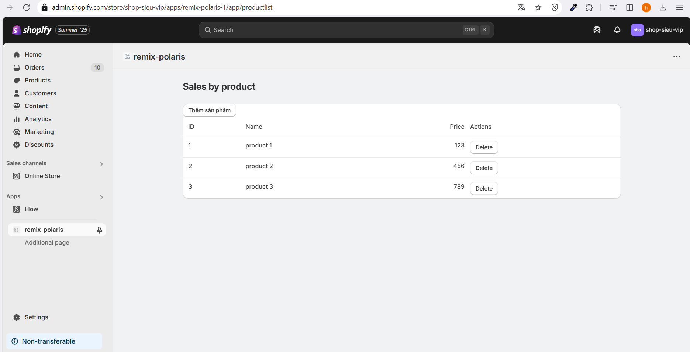
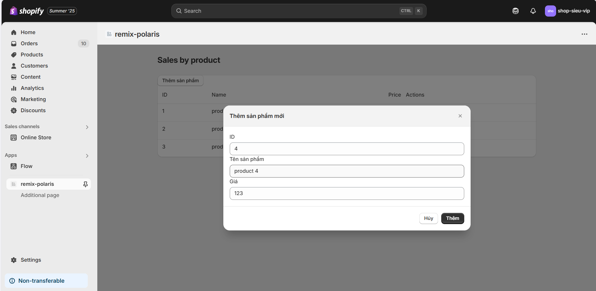
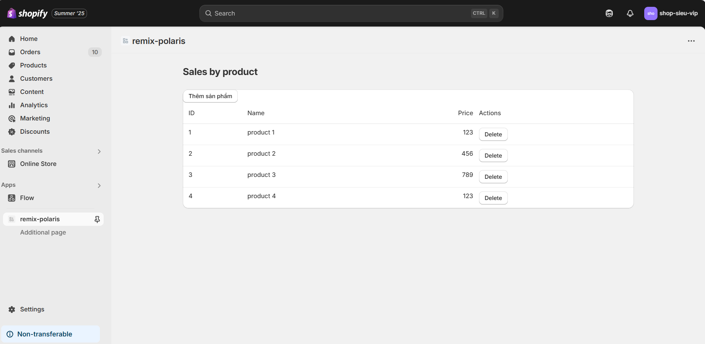
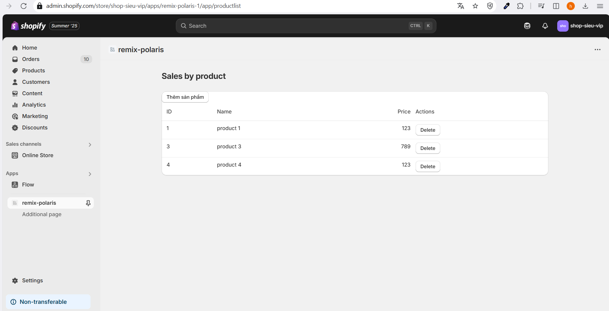

# Day 28:  Shopify Polaris & UI Advanced
## 1. Nội dung chính
Tìm hiểu Polaris Design System
Các component quan trọng (Card, ResourceList, Form, Modal…)
Kết hợp Polaris + Remix để build UI

## 2. Bài tập
Render danh sách Product bằng Polaris ResourceList
Thêm Button thêm/xóa product giả lập

---

## Giải thích
#### 1. Tạo dự án remix shopify bằng cli 
#### 2. Tạo file app.ProductList.jsx trong thư mục app/routes
```jsx
// app/routes/app.ProductList.jsx
import {
  Page,
  LegacyCard,
  DataTable,
  Button,
  Modal,
  TextField
} from '@shopify/polaris';
import { json } from '@remix-run/node';
import { useLoaderData } from '@remix-run/react';
import React, { useState } from 'react';


export const loader = async () => {
  
  const fakeDataProduct = [
    { id: 1, name: 'product 1', price: 123 },
    { id: 2, name: 'product 2', price: 456 },
    { id: 3, name: 'product 3', price: 789 },
  ];
  return json(fakeDataProduct);
};

export default function ProductList() {
  const initialProducts = useLoaderData();
  const [products, setProducts] = useState(initialProducts);
  const [active, setActive] = useState(false);

  const [id, setId] = useState('');
  const [name, setName] = useState('');
  const [price, setPrice] = useState('');

  const toggleModal = () => setActive(!active);

  const handleDelete = (id) => {
    const updatedProducts = products.filter((product) => product.id !== id);
    setProducts(updatedProducts);
  };

  const handleAddProduct = () => {
    const newProduct = {
      id: parseInt(id),
      name,
      price: parseFloat(price),
    };

    setProducts([...products, newProduct]);

    setId('');
    setName('');
    setPrice('');
    toggleModal();
  };

  const rows = products.map((product) => [
    product.id,
    product.name,
    product.price,
    <Button destructive onClick={() => handleDelete(product.id)}>Delete</Button>,
  ]);

  return (
    <Page title="Sales by product">
      <LegacyCard>
        <Button primary onClick={toggleModal}>Thêm sản phẩm</Button>
        <DataTable
          columnContentTypes={['text', 'text', 'numeric', 'text']}
          headings={['ID', 'Name', 'Price', 'Actions']}
          rows={rows}
        />
      </LegacyCard>

      <Modal
        open={active}
        onClose={toggleModal}
        title="Thêm sản phẩm mới"
        primaryAction={{
          content: 'Thêm',
          onAction: handleAddProduct,
        }}
        secondaryActions={[{ content: 'Hủy', onAction: toggleModal }]}
      >
        <Modal.Section>
          <TextField
            label="ID"
            type="number"
            value={id}
            onChange={setId}
            autoComplete="off"
          />
          <TextField
            label="Tên sản phẩm"
            value={name}
            onChange={setName}
            autoComplete="off"
          />
          <TextField
            label="Giá"
            type="number"
            value={price}
            onChange={setPrice}
            autoComplete="off"
          />
        </Modal.Section>
      </Modal>
    </Page>
  );
}

```
#### 3. npm run dev để chạy dự án
#### 4. Demo
giao diện chính

thêm sản phẩm 


xóa sản phẩm 
