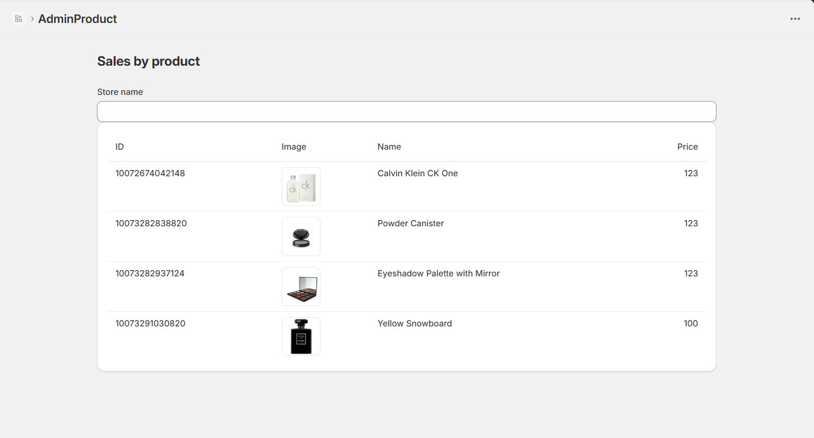
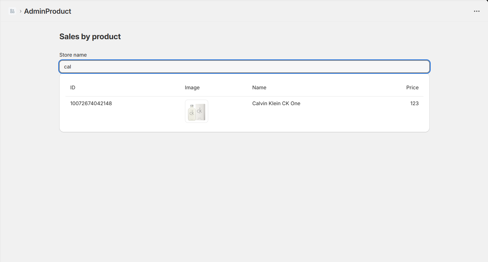

# Day 29-30: Shopify React Hooks + API Admin nâng cao
## 1. Nội dung chính
* Shopify useAppBridge, useAuthenticatedFetch
* Call Shopify Admin API qua App Bridge
* Pagination / Filter / Query param

## 2. Bài tập
Tạo trang /admin-products
Call thật Shopify Admin API (GraphQL)
Hiển thị danh sách sản phẩm có filter theo title

--- 
## Giải thích lý thuyết
Dưới đây là giải thích chi tiết bằng tiếng Việt về **Shopify React Hooks** (`useAppBridge`, `useAuthenticatedFetch`), cách gọi **Shopify Admin API** qua App Bridge, và cách xử lý **phân trang (pagination)**, **lọc (filter)**, và **tham số truy vấn (query params)** cho Day 29-30 của lộ trình học.

---

### **1. useAppBridge** 
[Docs shopify tại đây](https://shopify.dev/docs/api/app-bridge)
**`useAppBridge`** là một React Hook từ thư viện `@shopify/app-bridge-react`, cho phép ứng dụng của bạn tương tác với giao diện Shopify Admin thông qua Shopify App Bridge.

- **Mục đích**: Giúp ứng dụng React nhúng (embedded app) giao tiếp với Shopify Admin, ví dụ: điều hướng, hiển thị thông báo (toast), hoặc mở modal.
- **Cài đặt**:
  - Cài đặt thư viện: `npm install @shopify/app-bridge-react`.
  - Bọc ứng dụng bằng `<AppBridgeProvider>` và cung cấp `config` bao gồm `apiKey`, `host`, và `forceRedirect`.
  ```jsx
  import { AppBridgeProvider } from '@shopify/app-bridge-react';

  function App() {
    const config = {
      apiKey: 'YOUR_API_KEY',
      host: 'YOUR_SHOPIFY_HOST',
      forceRedirect: true,
    };

    return (
      <AppBridgeProvider config={config}>
        <MyComponent />
      </AppBridgeProvider>
    );
  }
  ```
- **Sử dụng**:
  ```jsx
  import { useAppBridge } from '@shopify/app-bridge-react';
  import { Redirect } from '@shopify/app-bridge/actions';

  function MyComponent() {
    const app = useAppBridge();

    const redirectToProduct = () => {
      const redirect = Redirect.create(app);
      redirect.dispatch(Redirect.Action.APP, '/products');
    };

    return <button onClick={redirectToProduct}>Chuyển đến Trang Sản phẩm</button>;
  }
  ```
- **Tính năng chính**:
  - **Điều hướng**: Chuyển hướng đến các trang trong Shopify Admin (ví dụ: trang sản phẩm, đơn hàng).
  - **Giao diện người dùng**: Tạo thông báo (toast), modal, hoặc trạng thái tải (loading).
  - **Ngữ cảnh**: Lấy thông tin cửa hàng (shop domain) hoặc quyền người dùng.
- **Ví dụ**:
  - Hiển thị thông báo: 
    ```jsx
    import { Toast } from '@shopify/app-bridge/actions';
    const toast = Toast.create(app, { message: 'Thành công!' });
    toast.dispatch(Toast.Action.SHOW);
    ```
  - Mở modal: Sử dụng `Modal.create(app)` để tạo hộp thoại tùy chỉnh.

---

### **2. useAuthenticatedFetch**
**`useAuthenticatedFetch`** là một hook giúp gọi API Shopify Admin một cách an toàn với token xác thực.

- **Mục đích**: Cung cấp hàm `fetch` đã được cấu hình sẵn với token OAuth của Shopify, giúp gọi API Admin dễ dàng.
- **Cài đặt**: Cần `@shopify/app-bridge-react` và `<AppBridgeProvider>` bao quanh component.
- **Sử dụng**:
  ```jsx
  import { useAuthenticatedFetch } from '@shopify/app-bridge-react';

  function MyComponent() {
    const fetch = useAuthenticatedFetch();

    const getProducts = async () => {
      try {
        const response = await fetch('/api/products');
        const data = await response.json();
        console.log(data); // Danh sách sản phẩm
      } catch (error) {
        console.error('Lỗi khi lấy sản phẩm:', error);
      }
    };

    return <button onClick={getProducts}>Lấy Sản phẩm</button>;
  }
  ```
- **Tính năng chính**:
  - Tự động thêm token xác thực vào header `Authorization`.
  - Hỗ trợ cả REST và GraphQL API.
  - Xử lý CORS và giới hạn tốc độ API (rate limits) của Shopify.
- **Ví dụ**:
  - Lấy danh sách sản phẩm: `fetch('/api/products')`.
  - Tạo sản phẩm mới:
    ```jsx
    const productData = { title: 'Sản phẩm mới', vendor: 'Shop' };
    await fetch('/api/products', {
      method: 'POST',
      body: JSON.stringify(productData),
    });
    ```

---

### **3. Gọi Shopify Admin API qua App Bridge**
Để gọi Shopify Admin API, bạn sử dụng `useAuthenticatedFetch` để gửi yêu cầu đến các endpoint của Shopify (REST hoặc GraphQL). Các bước cơ bản:

1. **Cấu hình server proxy**:
   - Shopify yêu cầu các yêu cầu API đi qua server của bạn để đảm bảo bảo mật.
   - Ví dụ: Trong Node.js, tạo endpoint `/api/products` để gọi Shopify Admin API.
   ```javascript
   app.get('/api/products', async (req, res) => {
     const session = await Shopify.Auth.validateAuthCallback(req, res);
     const client = new Shopify.Clients.Rest(session.shop, session.accessToken);
     const products = await client.get({ path: 'products' });
     res.json(products);
   });
   ```

2. **Gọi API từ frontend**:
   - Sử dụng `useAuthenticatedFetch` để gọi endpoint proxy trên server.
   - Ví dụ: `fetch('/api/products')` sẽ gọi endpoint `/api/products` trên server, sau đó server gọi Shopify Admin API.

3. **GraphQL Example**:
   ```jsx
   const query = `query { shop { name } }`;
   const response = await fetch('/api/graphql', {
     method: 'POST',
     body: JSON.stringify({ query }),
   });
   const data = await response.json();
   console.log(data); // Thông tin cửa hàng
   ```

---

### **4. Phân trang (Pagination), Lọc (Filter), Tham số truy vấn (Query Params)**

#### **Phân trang (Pagination)**
Shopify Admin API sử dụng **cursor-based pagination** cho REST và GraphQL để xử lý danh sách lớn (ví dụ: sản phẩm, đơn hàng).

- **REST API**:
  - Sử dụng tham số `page_info` hoặc `limit` để phân trang.
  - Ví dụ: Lấy 10 sản phẩm mỗi trang:
    ```jsx
    const response = await fetch('/api/products?limit=10');
    const data = await response.json();
    const nextPage = data.next_page_info; // Lưu page_info để lấy trang tiếp theo
    ```
  - Để lấy trang tiếp theo:
    ```jsx
    await fetch(`/api/products?limit=10&page_info=${nextPage}`);
    ```

- **GraphQL API**:
  - Sử dụng `first`, `last`, `after`, `before` trong truy vấn.
  - Ví dụ:
    ```graphql
    query {
      products(first: 10, after: "cursor") {
        edges {
          node {
            id
            title
          }
        }
        pageInfo {
          hasNextPage
          endCursor
        }
      }
    }
    ```
  - Lấy trang tiếp theo bằng `endCursor`:
    ```jsx
    const query = `query { products(first: 10, after: "${endCursor}") { ... } }`;
    await fetch('/api/graphql', { method: 'POST', body: JSON.stringify({ query }) });
    ```

#### **Lọc (Filter)**
- **REST API**: Sử dụng query params để lọc, ví dụ:
  - Lấy sản phẩm theo trạng thái: `fetch('/api/products?status=active')`.
  - Lấy sản phẩm theo nhà cung cấp: `fetch('/api/products?vendor=ShopName')`.
- **GraphQL API**: Sử dụng tham số `query` trong truy vấn:
  ```graphql
  query {
    products(first: 10, query: "vendor:ShopName") {
      edges {
        node {
          title
        }
      }
    }
  }
  ```

#### **Tham số truy vấn (Query Params)**
- **REST**: Thêm trực tiếp vào URL, ví dụ: `/api/products?fields=id,title&limit=5`.
- **GraphQL**: Đưa vào biến hoặc trực tiếp trong truy vấn:
  ```jsx
  const query = `query($filter: String) { products(first: 10, query: $filter) { ... } }`;
  const variables = { filter: "title:shirt" };
  await fetch('/api/graphql', {
    method: 'POST',
    body: JSON.stringify({ query, variables }),
  });
  ```

---
## Demo giao diện
Giao diện chính

Filter product

