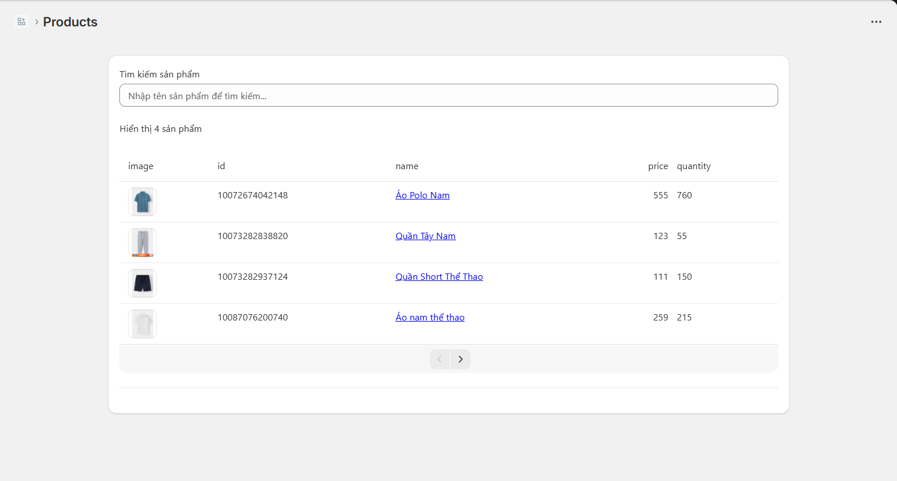
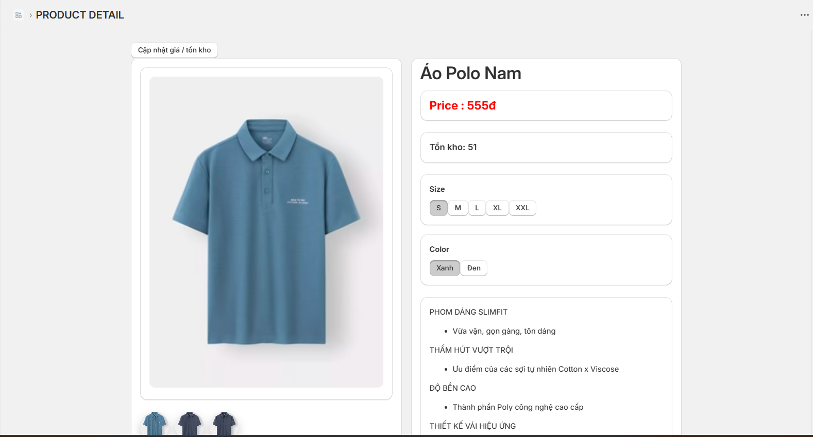
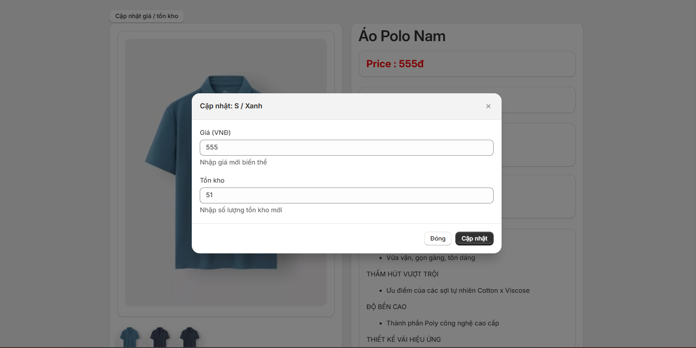
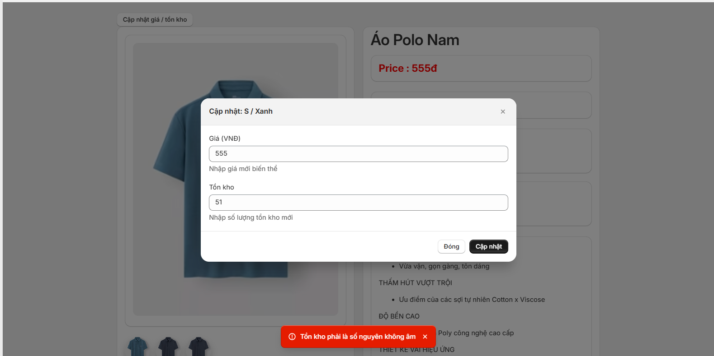
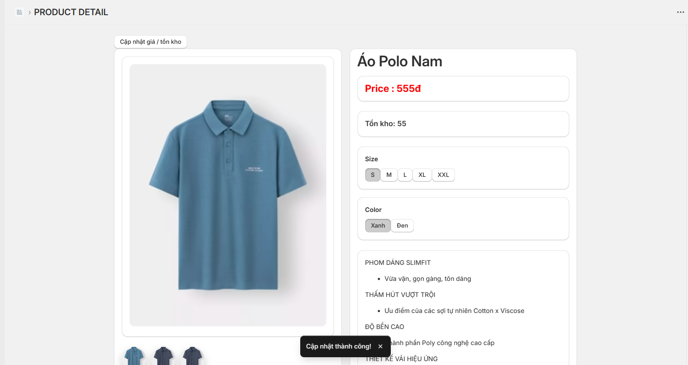
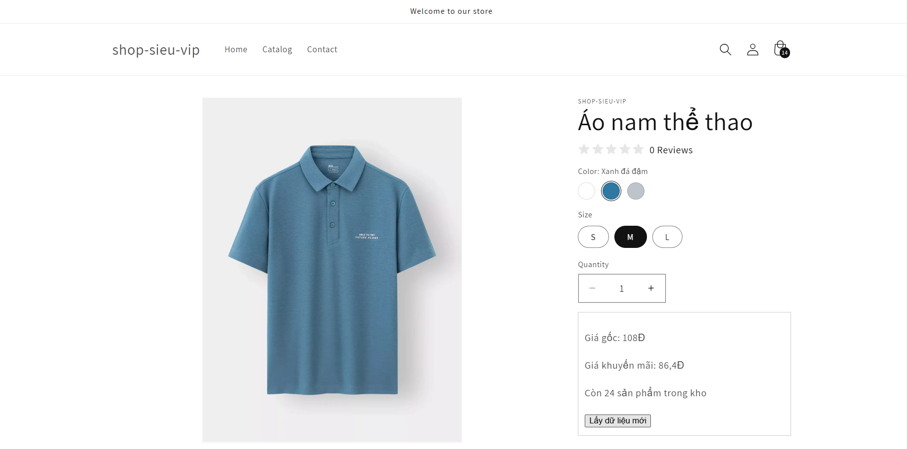
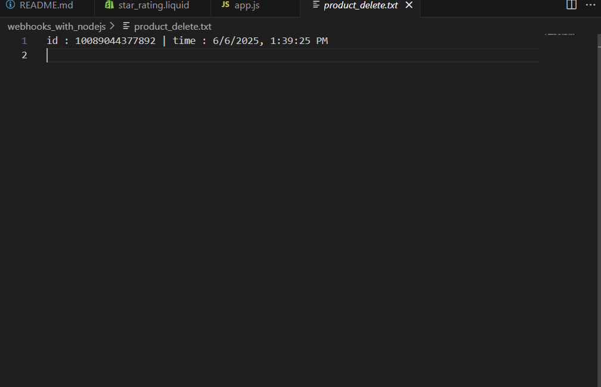
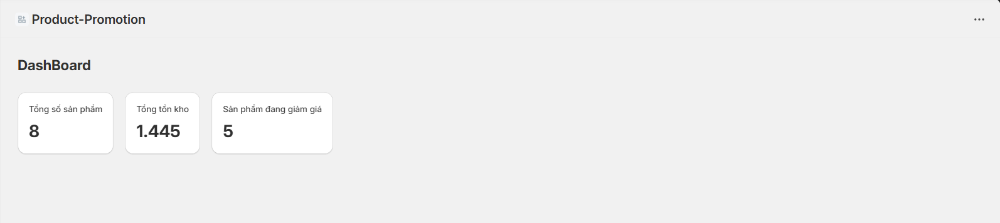

# Tuần 7 & Tuần 8: Project - Shopify App Hoàn chỉnh
## Xây dựng Shopify App - "Product Promotion & Stock Manager"
Mục tiêu: Xây dựng 1 Shopify Embedded App có khả năng:
Hiển thị danh sách sản phẩm từ Shopify
Cập nhật thông tin sản phẩm (giá khuyến mãi / tồn kho)
Tương tác với Shopify Theme (App Block / ScriptTag)
Có trang Dashboard sử dụng Polaris
Xử lý Webhook khi sản phẩm bị xoá
Validate input, handle error
Có chức năng OAuth đầy đủ

---

### 1. Authentication & OAuth
- Đã được xử lý tự động trong source remix
### 2. Product Listing - Sử dụng Shopify Admin API
- Lấy danh sách sản phẩm + phân trang

- Trang chi tiết sản phẩm 

### 3. Product Update - Giá & Tồn kho
- Form update giá giảm / tồn kho

- Validate đầu vào (middleware)


Theme Interaction - App Block hoặc ScriptTag


#### 4.App cho phép inject App Block vào Product Page
Nội dung hiển thị:
Giá gốc
Giá khuyến mãi
Thông điệp "Còn X sản phẩm trong kho"
Có nút call API riêng lấy dữ liệu dynamic từ app (không chỉ lấy từ Shopify)

```
Cách chạy : 
cd thư mục webhooks_with_nodejs
npm run dev
Sử dụng ngrok hoặc localtunnel để host server
```



### 5. Webhook - Product Delete
Đăng ký webhook PRODUCT_DELETE
Khi sản phẩm bị xoá => log ra file hoặc ghi vào database
// webhooks_with_nodejs/product_delete.txt


### 6. Dashboard thống kê (Polaris)
Số sản phẩm đang có trong app
Tổng tồn kho các sản phẩm
Tổng sản phẩm đang giảm giá

